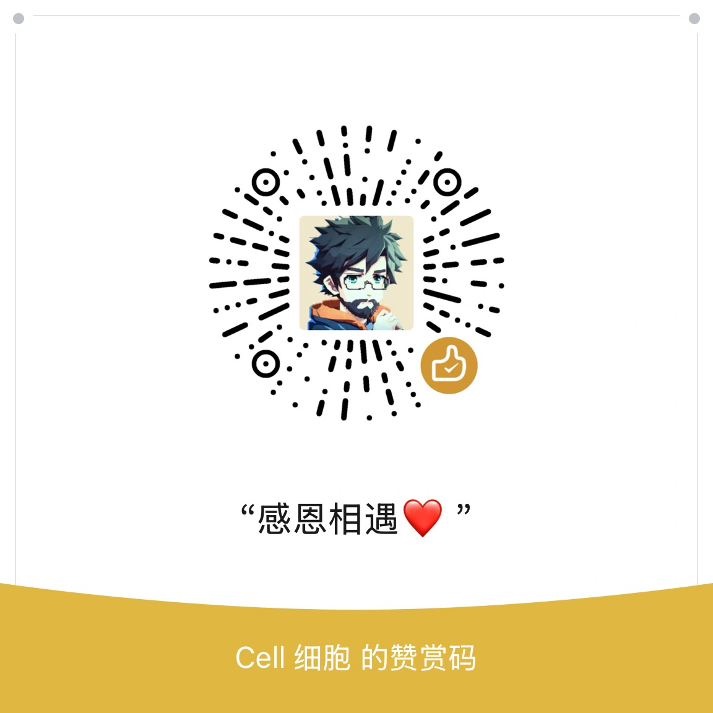

# Pi Agent 原理与实现：从零到一实现一个 AI Agent

这是一个完整可运行的中文 VitePress 教程项目，参考 [earendil-works/pi](https://github.com/earendil-works/pi) 与 [pi.dev 官方文档](https://pi.dev/docs/latest)，从工程视角拆解 Pi Agent 的核心原理，并带你实现一个教学版 Agent。

教程不是逐文件源码翻译，而是按学习路径组织：

- 核心概念：Agent Loop、消息、流式事件、工具调用、会话树、上下文压缩。
- Pi 源码拆解：`pi-ai`、`pi-agent-core`、`pi-coding-agent` 的分层和关键链路。
- 渐进式 Demo：四个核心 TypeScript 小 Demo 从最小循环逐步加工具、会话和压缩，另有一个可选真模型烟测 Demo。
- 最终项目：React + Node.js + TypeScript 实现一个可运行的教学版 Agent。

## 运行教程站点

```bash
npm install
npm run docs:dev
```

构建验证：

```bash
npm run docs:build
```

## 部署教程站点到 Vercel

本仓库默认部署 VitePress 教程站点，配置见 `vercel.json`：

- Install Command：`npm install`
- Build Command：`npm run docs:build`
- Output Directory：`docs/.vitepress/dist`

本地已登录 Vercel CLI 时，可以执行：

```bash
npx vercel deploy --prod
```

教学版 Agent 的 Express API 仍是本地教学运行时，不随这个静态站点配置一起部署。

## 运行渐进式 Demo

```bash
npm run demo:01
npm run demo:02
npm run demo:03
npm run demo:04
```

可选真实模型烟测：

```bash
OPENAI_COMPATIBLE_BASE_URL="https://example.com/v1" \
OPENAI_COMPATIBLE_API_KEY="你的 key" \
OPENAI_COMPATIBLE_MODEL="mimo-v2.5-pro" \
npm run demo:05
```

请只通过环境变量传入 API Key，不要把密钥写进仓库。

## 运行教学版 Agent

```bash
npm run teaching-agent:dev
```

默认地址：

- 前端：`http://localhost:5174/`
- API：`http://localhost:4317/`

也可以单独检查：

```bash
npm run teaching-agent:test
npm run teaching-agent:typecheck
npm run teaching-agent:build
```

## 项目结构

```text
docs/                         # VitePress 教程站点
examples/demos/                # 四个核心渐进式 Demo + 可选真模型烟测
examples/teaching-agent/       # React + Node 教学版目标项目
specs/                         # 项目计划与工作日志
```

## 联系我

Hi，我是 Cell 细胞。可以扫码加我微信，备注 **Github** 就行。

我正在做订阅制真人秀 **造物矩阵·BIP**：👉 [zwjz.flowus.cn](https://zwjz.flowus.cn)，欢迎订阅。

社媒更新：👉 [X / Twitter @cellinlab](https://x.com/cellinlab)

更多信息：👉 [Cell 的个人说明书](https://chaojizhizao.feishu.cn/wiki/Gbm8wMdS1itpk7kIVRlcN2WCnw)

<table align="center">
  <tr>
    <td align="center" width="33%">
      <br>
      <p align="center">扫码加微信</p>
    </td>
    <td align="center" width="33%">
      <br>
      <p align="center">视频号</p>
    </td>
    <td align="center" width="33%">
      <br>
      <p align="center">公众号</p>
    </td>
  </tr>
</table>

## 赞助

<table align="center">
  <tr>
    <td align="center" width="50%">
      <br>
      <p align="center">支付宝</p>
    </td>
    <td align="center" width="50%">
      <br>
      <p align="center">微信赞赏</p>
    </td>
  </tr>
</table>

## License

MIT
