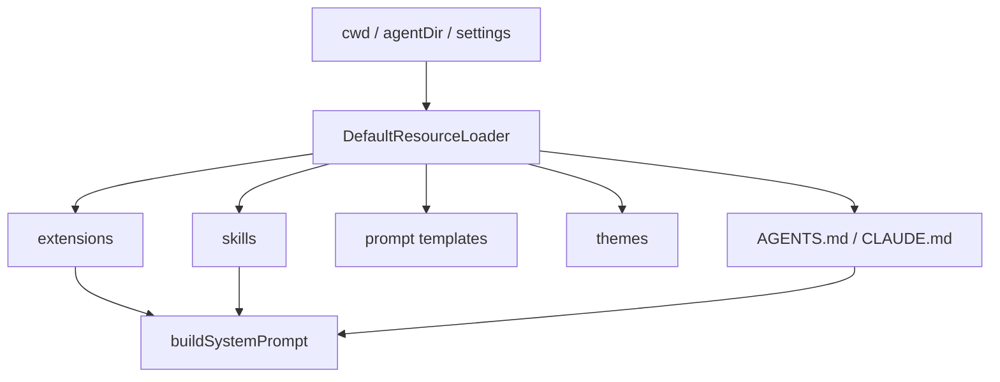
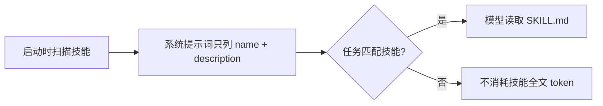
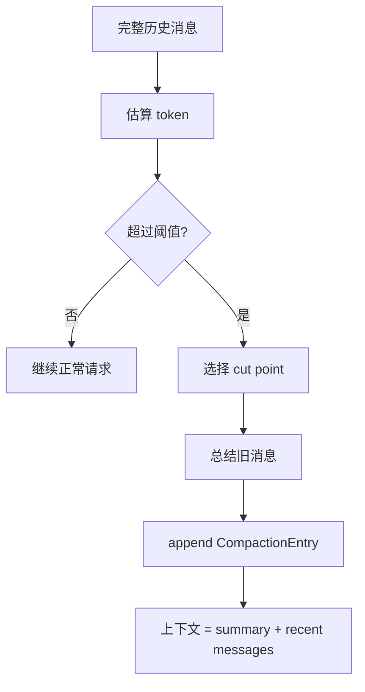

# 上下文、技能与压缩

Agent 每次请求模型时，并不是只发送用户刚输入的一句话。通常还会包含：

| 内容 | 来源 |
| --- | --- |
| 系统提示词 | Agent 内置规则、工具说明、行为约束 |
| 项目上下文 | `AGENTS.md`、项目规则、当前工作目录 |
| 技能索引 | 可用技能的名称和描述 |
| 历史消息 | 当前会话 leaf 上的消息路径 |
| 工具定义 | 当前启用工具的 schema |

这就是为什么上下文管理会变成 Agent 框架的核心问题。

## ResourceLoader 做什么

Pi 的 `DefaultResourceLoader` 负责加载这些资源：



重点不是“加载文件”本身，而是把外部资源转成稳定的运行时输入：系统提示词、工具、命令、事件处理器。

## 技能为什么不是一直全文注入

Pi 的 Skills 机制只在系统提示词中放技能名称和描述。真正需要时，模型再用 `read` 读取完整 `SKILL.md`。

这样做的原因很实际：如果每个技能的全文都塞进系统提示词，长一点的技能库会直接吃掉上下文窗口。



## 上下文压缩

长会话一定会遇到上下文窗口限制。Pi 的 compaction 不是简单删除老消息，而是：

1. 找到可以切分的旧消息范围。
2. 用模型把旧内容总结成结构化摘要。
3. 写入 `CompactionEntry`。
4. 后续构建上下文时，发送“摘要 + 最近保留消息”。



## 为什么压缩要保留最近消息

摘要适合保存“做过什么、得出什么结论”，但它不适合替代最新几轮的细节。最近消息里通常有：

| 内容 | 为什么要保留原文 |
| --- | --- |
| 最新工具输出 | 模型可能还要基于精确文本继续处理 |
| 刚修改的文件片段 | 摘要容易丢细节 |
| 当前用户约束 | 最新指令应高优先级保留 |
| 错误日志 | 错误堆栈摘要后可能失真 |

所以真实系统通常是“摘要旧内容 + 原样保留最近内容”的组合。

## 教学版的简化压缩

我们的 Demo 4 会用一个非常朴素的 token 估算：按字符长度近似。压缩器也不是调用真实模型，而是把旧消息压成一段摘要文本。

它不智能，但能展示关键结构：

```ts
{
  type: "compaction",
  summary: "用户让 Agent 检查 README，工具读取了 README...",
  firstKeptEntryId: "entry_8",
  tokensBefore: 12400
}
```

理解结构比一开始追求摘要质量更重要。真正接模型时，你只需要替换 summarizer。

## 小练习

把 `examples/demos/04-compaction.ts` 中的 `keepRecentCount` 从 `2` 改成 `4`，观察摘要内容和最终上下文如何变化。
