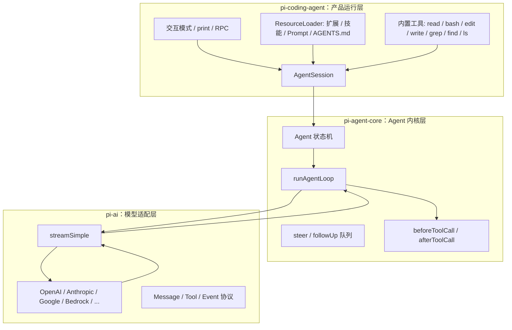

# Pi 的总体架构

Pi 的架构最值得学习的地方，是它把“不稳定的外部世界”和“稳定的核心循环”分开了。

大模型供应商会变，工具会变，UI 会变，用户想安装的扩展也会变。但 Agent Loop 的本质相对稳定：准备上下文、请求模型、处理工具、写回结果、继续或停止。

## 三层分工



## 每层为什么存在

### `pi-ai`：把供应商差异关在一层

不同模型 API 对工具调用、推理内容、缓存、错误、OAuth、流式协议的表达都不同。Pi 把这些差异统一成 `Message`、`Tool`、`AssistantMessageEvent` 和 `streamSimple()`。

这样上层 Agent Loop 不需要知道“这是 Anthropic 的 tool_use，还是 OpenAI Responses 的 function call”。它只关心统一后的 `toolCall` 内容块。

### `pi-agent-core`：只管 Agent 运行时

这一层不关心终端 UI，也不关心 `.pi/extensions` 在哪里。它主要处理：

| 模块 | 职责 |
| --- | --- |
| `Agent` | 保存状态、暴露 `prompt()`、`steer()`、`followUp()`、`abort()` |
| `runAgentLoop` | 真正的循环：模型请求、工具执行、下一轮判断 |
| `AgentEvent` | 把生命周期、消息更新、工具执行过程发出去 |
| hooks | 在工具执行前后给产品层和扩展拦截机会 |

这一层越小，越容易测试。Pi 的 `packages/agent/test/agent-loop.test.ts` 就是在验证这些控制流。

### `pi-coding-agent`：把 Agent 变成可用产品

写一个 Agent Loop 不难，难的是把它变成每天能用的开发工具。产品层负责这些“麻烦但关键”的事情：

| 能力 | 为什么重要 |
| --- | --- |
| 会话 JSONL | 重启后可以继续；可以回到某个节点重新分支 |
| 资源加载 | 自动加载项目规则、技能、提示模板、扩展 |
| 内置工具 | 读文件、执行命令、编辑代码是 coding agent 的基本动作 |
| 上下文压缩 | 长会话不至于爆上下文窗口 |
| 扩展系统 | 用户能加权限门、远程执行、定制 UI、接入外部服务 |
| 多运行模式 | 同一核心可以服务 TUI、脚本、RPC 集成 |

## 一次请求的完整链路

```mermaid
sequenceDiagram
  participant UI as TUI/RPC/SDK
  participant Session as AgentSession
  participant Agent as Agent
  participant Loop as Agent Loop
  participant AI as pi-ai
  participant Tool as 工具
  participant Store as SessionManager

  UI->>Session: prompt(text)
  Session->>Session: 展开技能/模板，检查模型和认证
  Session->>Agent: prompt(messages)
  Agent->>Loop: runAgentLoop(context, config)
  Loop->>AI: streamSimple(model, context)
  AI-->>Loop: message_update / toolCall
  Loop->>Tool: execute(args)
  Tool-->>Loop: AgentToolResult
  Loop-->>Agent: AgentEvent
  Agent-->>Session: 事件回调
  Session->>Store: appendMessage / appendToolResult
  Session-->>UI: AgentSessionEvent
```

## 教学版项目会怎么缩小

真实 Pi 要处理很多供应商、平台、扩展和长期会话。我们的教学版会保留核心思想，但做四个简化：

| Pi 真实实现 | 教学版实现 |
| --- | --- |
| 多模型供应商 | 一个确定性 `MockModel`，可替换成真实 API |
| 全量扩展系统 | 简化为工具注册表和 hooks |
| 完整 JSONL 树 | 保留 `id`/`parentId`/`leafId` 的最小会话树 |
| TUI/RPC/print | React 页面 + Node API |

这样读者能先把骨架吃透，再决定要不要补齐生产级能力。
