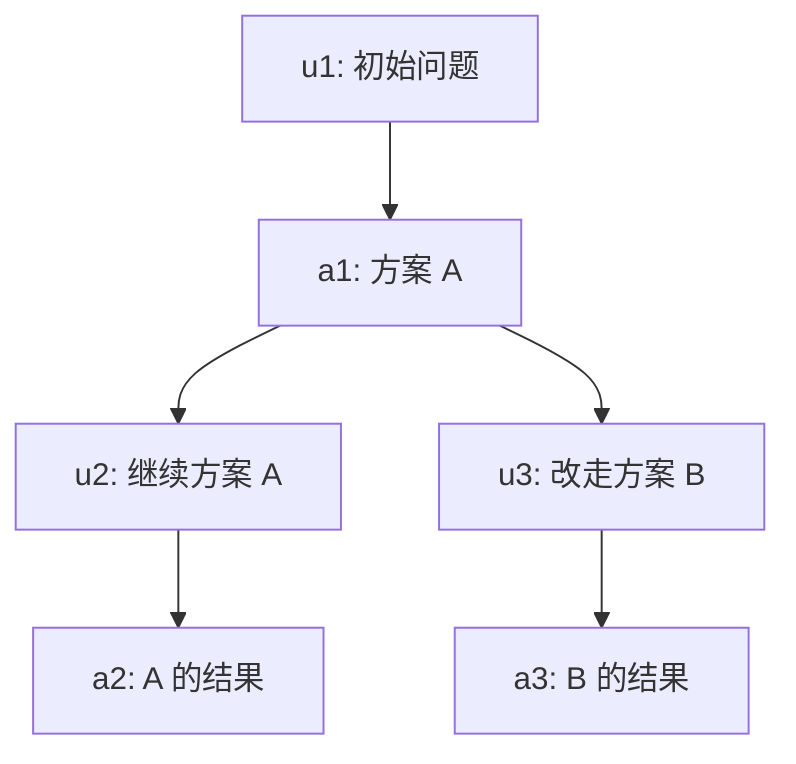
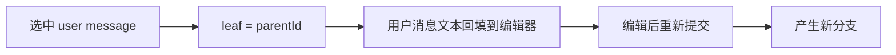

# 会话、树与分支

会话不是聊天记录的简单数组。对 coding agent 来说，会话承担了三个职责：

1. 保存历史，支持继续工作。
2. 支持从早期节点重新探索另一条路径。
3. 为上下文构建、压缩和导出提供结构化材料。

Pi 使用 JSONL 文件保存会话，并用 `id` / `parentId` 把条目组织成树。

## 为什么是 JSONL

JSONL 的每一行都是一个独立 JSON 对象。

```json
{"type":"session","version":3,"id":"s1","cwd":"/project"}
{"type":"message","id":"a1","parentId":null,"message":{"role":"user","content":"修 README"}}
{"type":"message","id":"a2","parentId":"a1","message":{"role":"assistant","content":[]}}
```

它的好处是：

| 优点 | 解释 |
| --- | --- |
| 追加写简单 | 每产生一个条目就 append 一行 |
| 崩溃恢复友好 | 已写入的行仍可解析 |
| 适合长会话 | 不必每次重写整个大 JSON |
| 便于外部工具处理 | `rg`、脚本、日志工具都能扫 |

## 树结构



如果当前 leaf 是 `D`，上下文就是 `A -> B -> C -> D`。当你跳回 `B` 并提交新用户消息，就产生 `E -> F` 这条新分支。旧分支不会丢。

## leaf 的意义

`leafId` 是当前会话视角的末端。构建上下文时，不是把文件里所有条目都发给模型，而是从 leaf 一路沿 `parentId` 回溯到根，再反转成顺序。

```ts
function buildContext(leaf: Entry, byId: Map<string, Entry>) {
  const path: Entry[] = [];
  let current: Entry | undefined = leaf;
  while (current) {
    path.unshift(current);
    current = current.parentId ? byId.get(current.parentId) : undefined;
  }
  return path.flatMap(entryToMessage);
}
```

## 分支时用户消息怎么处理

Pi 的 `/tree` 有一个很妙的交互：如果你选中一条用户消息，它不是把 leaf 移到这条消息，而是移到它的父节点，并把这条用户消息放回编辑器。

这样你可以改写原问题，然后重新提交，形成一条新分支。



## 分支摘要

当你从一条长分支切到另一条分支时，有时不想完全丢掉离开分支上的重要发现。Pi 支持 branch summary：把离开的分支总结成一个条目，附着到新位置。

这不是普通压缩，而是“跨分支携带经验”。

## 教学版保留什么

我们的教学版会保留：

| 能力 | 保留程度 |
| --- | --- |
| JSONL append | 保留 |
| `id` / `parentId` | 保留 |
| `leafId` | 保留 |
| 从 leaf 构建上下文 | 保留 |
| branch summary | 作为扩展练习 |
| 完整 TUI tree selector | 不实现，只用 API/日志展示 |

## 小练习

运行：

```bash
npm run demo:03
```

观察输出里的两条分支。然后把 Demo 改成三条分支，试着预测每个 leaf 对应的上下文路径。
