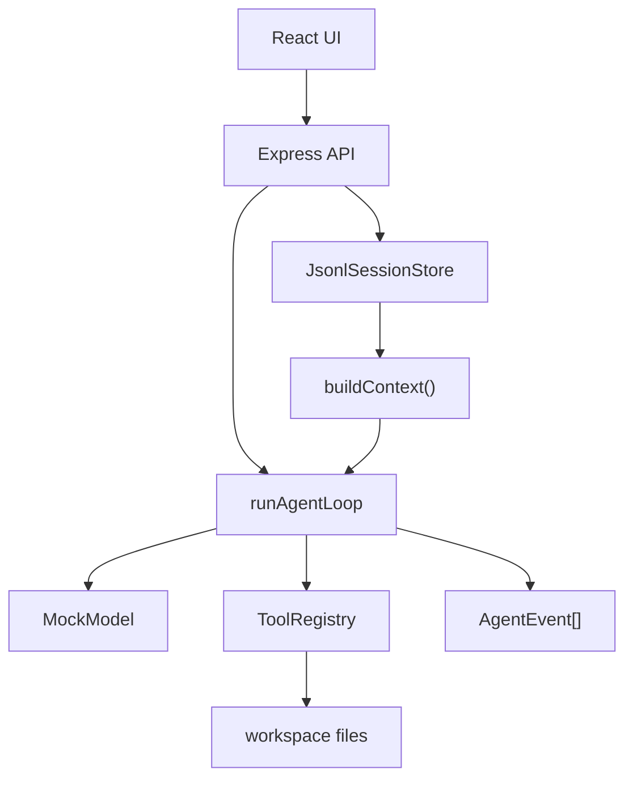

# 从零实现路线

前面的 Demo 是把机制拆小；这一部分把机制重新装回一个可运行项目。目标不是复制 Pi，而是用 React + Node.js + TypeScript 写出一个“保留核心思想”的教学版 Agent。

最终代码已经放在 `examples/teaching-agent/`，这一组章节会告诉你如果从空目录开始，应该按什么顺序实现。

## 你要做出的系统



最小闭环是：

1. 前端提交用户输入。
2. API 把输入追加为 `user` message。
3. API 从 session store 构造上下文。
4. Agent Loop 请求 MockModel。
5. MockModel 可能返回 tool call。
6. ToolRegistry 执行工具。
7. 工具结果回写成 `toolResult` message。
8. Loop 再请求 MockModel，直到得到最终回答。
9. API 持久化新消息并返回事件时间线。

## 为什么按这个顺序实现

| 步骤 | 为什么先做它 |
| --- | --- |
| 共享协议 | 前后端、loop、store 必须先讲同一种消息语言 |
| Loop + MockModel | 先跑通 Agent 的控制流，不被 HTTP 和 UI 打断 |
| 工具系统 | 让 Agent 从“回答”升级到“行动” |
| JSONL 会话 | 让上下文从内存数组变成可恢复的历史 |
| Express API | 把运行时包装成前端可调用的服务 |
| React 前端 | 可视化消息、工具调用和事件 |
| 调试验收 | 确认读者可以知道系统坏在哪里 |

这个顺序也对应 Pi 的真实分层：先协议，再 Agent Core，再 Coding Agent 运行层。

## 推荐跟做方式

```bash
cd examples/teaching-agent
npm install
npm run dev
```

如果你想真正从空目录练习，可以新建一个目录，把每一步的代码按章节复制进去。跟做时建议每完成一步就提交一次，这样出错后可以回到最近的可运行状态。

## 每一步的验收

| 页面 | 验收命令或动作 |
| --- | --- |
| [Step 1：共享协议](/project/build-01-protocol) | `npm run typecheck` 能识别消息类型 |
| [Step 2：Loop 与 MockModel](/project/build-02-loop-model) | 后端能在内存里得到 assistant/toolResult |
| [Step 3：工具系统](/project/build-03-tools) | `list_files`、`read_file`、`write_note` 可执行 |
| [Step 4：JSONL 会话](/project/build-04-session-store) | `.teaching-agent/session.jsonl` 追加 entry |
| [Step 5：Express API](/project/build-05-api) | `GET /api/session`、`POST /api/prompt` 正常 |
| [Step 6：React 前端](/project/build-06-frontend) | 浏览器能看到聊天、工具、事件 |
| [Step 7：调试与验收](/project/build-07-debug) | 构建、API、桌面/移动视口通过 |

## 不要一开始就做的事

| 暂缓事项 | 原因 |
| --- | --- |
| 接真实模型 API | 你会同时调试 provider、鉴权、stream、tool call，变量太多 |
| 做多 session UI | 会提前引入路由、列表、切换状态，掩盖 Agent 主线 |
| 做完整权限审批 | 先用路径限制和白名单工具打底 |
| 做漂亮动画 | 先让事件时间线准确，视觉之后再升级 |

## 小练习

在开始写代码前，画出你自己的最小消息类型：`UserMessage`、`AssistantMessage`、`ToolResultMessage`。不要看下一章，先试着回答一个问题：工具调用应该放在 assistant message 里，还是单独放一张表里？

