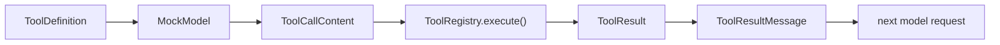

# Step 1：共享协议

共享协议是整个教学项目的地基。前端、后端、Agent Loop、工具系统和会话存储都要围绕同一组类型工作。

对应文件：

```text
examples/teaching-agent/src/shared/protocol.ts
```

## 这一步解决什么问题

如果没有共享协议，你很容易写出这种系统：

- 后端返回 `{ text: "..." }`。
- 前端以为有 `{ role, content }`。
- 工具结果只存在日志里。
- 会话存储又保存另一种格式。

Agent 项目最怕“每层自己发明消息格式”。所以我们第一步就定义稳定协议。

## 核心消息类型

```ts
export type TextContent = {
  type: "text";
  text: string;
};

export type ToolCallContent = {
  type: "toolCall";
  id: string;
  name: string;
  arguments: Record<string, unknown>;
};
```

这两个 content block 是关键：assistant message 里可以同时有文本和工具调用。

```ts
export type AgentMessage =
  | UserMessage
  | AssistantMessage
  | ToolResultMessage;
```

为什么工具结果也是消息？因为下一轮模型必须看见工具输出。工具结果只展示给前端是不够的。

## AssistantMessage 的设计

```ts
export type AssistantMessage = {
  role: "assistant";
  content: Array<TextContent | ToolCallContent>;
  stopReason: "stop" | "toolUse" | "error" | "aborted";
  usage: Usage;
  timestamp: number;
  errorMessage?: string;
};
```

这里保留了几个 Pi 式设计：

| 字段 | 为什么要有 |
| --- | --- |
| `content[]` | 支持 text 和 toolCall 混合 |
| `stopReason` | loop 根据它判断停止、继续或错误 |
| `usage` | 为压缩和成本统计预留位置 |
| `timestamp` | 会话、UI 和事件排序需要稳定时间 |

教学版没有 thinking、image、cache usage，但类型上已经留出了以后扩展的方向。

## ToolDefinition 和 ToolResult

```ts
export type ToolDefinition = {
  name: string;
  description: string;
  parameters: Record<string, unknown>;
};

export type ToolResult = {
  content: TextContent[];
  details?: unknown;
  terminate?: boolean;
};
```

`ToolDefinition` 会发给模型，告诉它有哪些工具。`ToolResult` 是本地执行结果，再被包装成 `ToolResultMessage` 写回上下文。



## SessionEntry

```ts
export type SessionEntry =
  | { type: "session"; version: 1; id: string; timestamp: string; cwd: string }
  | { type: "message"; id: string; parentId: string | null; timestamp: string; message: AgentMessage }
  | { type: "compaction"; id: string; parentId: string | null; timestamp: string; summary: string; firstKeptEntryId: string; tokensBefore: number };
```

这是教学版 JSONL 文件的每一行。`parentId` 是会话树的核心。即使我们暂时不做完整分支 UI，也要在类型层面保留它。

## AgentEvent

事件是 UI 的投影，不是唯一事实来源：

```ts
export type AgentEvent =
  | { type: "agent_start" }
  | { type: "turn_start"; turn: number }
  | { type: "message_update"; message: AssistantMessage; delta: string }
  | { type: "tool_execution_start"; toolCallId: string; toolName: string; args: Record<string, unknown> }
  | { type: "tool_execution_end"; toolCallId: string; toolName: string; result: ToolResult; isError: boolean };
```

前端用事件画时间线，后端用消息构建下一轮上下文。这个边界很重要。

## 运行检查

```bash
cd examples/teaching-agent
npm run typecheck
```

预期结果：

```text
> tsc --noEmit
```

没有类型错误就说明共享协议能被前后端同时引用。

## 常见错误

| 错误 | 后果 |
| --- | --- |
| 把 assistant content 设计成 string | 后续无法表达 tool call |
| 不保存 toolCall id | tool result 无法和调用对应 |
| 事件里有的信息消息里没有 | 页面看得到，但下一轮模型看不到 |
| SessionEntry 没有 parentId | 后续无法实现 fork、tree 和 compaction |

## 小练习

给 `AssistantMessage` 增加一个可选 `debug?: string` 字段，然后观察哪些文件会被 TypeScript 提示影响。这个练习能帮你感受共享协议的“向外扩散半径”。

