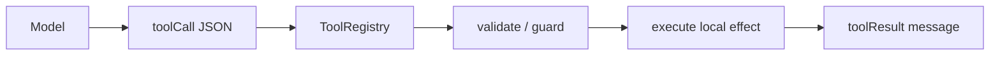

# Step 3：工具系统

工具系统让 Agent 从“能说”变成“能做”。这一步我们实现一个最小 `ToolRegistry`，并注册三个受控工具。

对应文件：

```text
examples/teaching-agent/src/server/agent/tools.ts
```

## 本节新增文件

```text
src/server/agent/tools.ts
workspace/README.md
workspace/agent-notes.md
```

本节只做本地工具系统。工具先能被 loop 调用，前端和 API 之后再接。

## 这一步解决什么问题

模型不能直接读写文件。它只能提出：

```json
{ "name": "read_file", "arguments": { "path": "README.md" } }
```

真正读文件的是本地运行时。这个边界非常重要：



## ToolRegistry

```ts
export class ToolRegistry {
  private readonly tools = new Map<string, RegisteredTool>();

  register(tool: RegisteredTool): void {
    this.tools.set(tool.name, tool);
  }

  definitions(): ToolDefinition[] {
    return Array.from(this.tools.values()).map(({ name, description, parameters }) => ({
      name,
      description,
      parameters,
    }));
  }

  async execute(name: string, args: Record<string, unknown>): Promise<ToolResult> {
    const tool = this.tools.get(name);
    if (!tool) throw new Error(`Tool not found: ${name}`);
    return tool.execute(args);
  }
}
```

注意 `definitions()` 不暴露 `execute`。模型只需要知道工具名称、描述和参数 schema，执行函数永远留在本地。

## 最小可复制 diff

如果你已经写完 Step 2，这一节的关键增量是：

```diff
+ export class ToolRegistry {
+   private readonly tools = new Map<string, RegisteredTool>();
+   register(tool: RegisteredTool): void { this.tools.set(tool.name, tool); }
+   definitions(): ToolDefinition[] { return Array.from(this.tools.values()).map(stripExecute); }
+   async execute(name: string, args: Record<string, unknown>): Promise<ToolResult> {
+     const tool = this.tools.get(name);
+     if (!tool) throw new Error(`Tool not found: ${name}`);
+     return tool.execute(args);
+   }
+ }
+
+ export function createToolRegistry(workspaceRoot: string): ToolRegistry {
+   const registry = new ToolRegistry();
+   registry.register(listFilesTool(workspaceRoot));
+   registry.register(readFileTool(workspaceRoot));
+   registry.register(writeNoteTool(workspaceRoot));
+   return registry;
+ }
```

完整实现请对照 `examples/teaching-agent/src/server/agent/tools.ts`。跟做时先把 `list_files` 跑通，再补 `read_file` 和 `write_note`。

## 三个内置工具

| 工具 | 用途 | 安全边界 |
| --- | --- | --- |
| `list_files` | 列出教学工作区文件 | 只能访问 `workspace/` |
| `read_file` | 读取 UTF-8 文本 | 路径必须在 `workspace/` 内 |
| `write_note` | 写 markdown 笔记 | 只写到 `workspace/notes/` |

路径保护是这一步最值得认真看的代码：

```ts
function resolveInsideWorkspace(workspaceRoot: string, input: string): string {
  const target = resolve(workspaceRoot, input);
  const root = resolve(workspaceRoot);
  const rel = relative(root, target);
  if (rel.startsWith("..") || (rel === "" && input.includes(".."))) {
    throw new Error(`Path escapes workspace: ${input}`);
  }
  return target;
}
```

即使是教学项目，也不要让模型参数直接决定任意文件路径。

## 工具结果格式

工具返回 `ToolResult`：

```ts
return {
  content: [text(entries.join("\n"))],
  details: { entries },
};
```

Loop 再把它包装成 `ToolResultMessage`：

```ts
{
  role: "toolResult",
  toolCallId: toolCall.id,
  toolName: toolCall.name,
  content: result.content,
  details: result.details,
  isError: false,
  timestamp: Date.now()
}
```

这样模型下一轮能看见工具输出，前端也能展示工具结果。

## 运行检查

启动项目后输入：

```text
读取 agent-notes.md
```

预期事件：

```text
tool_start: read_file
tool_end: read_file
message_update: 我读取到了文件内容...
```

预期回答里会出现 `agent-notes.md` 的内容摘要。

如果你还没有前端，可以在 `smoke.ts` 里直接调用：

```ts
const registry = createToolRegistry(resolve(process.cwd(), "workspace"));
console.log(await registry.execute("list_files", { path: "." }));
console.log(await registry.execute("read_file", { path: "agent-notes.md" }));
```

预期输出里至少包含：

```text
README.md
agent-notes.md
```

## 常见错误

| 错误 | 后果 |
| --- | --- |
| `definitions()` 把 execute 发给前端 | 泄漏本地实现，且无法序列化 |
| 不限制路径 | 模型可能读取工作区外文件 |
| 工具抛错后中断进程 | loop 无法生成 `isError` toolResult |
| 工具输出无限长 | 一次日志就撑爆上下文 |

## 小练习

给 `write_note` 加一个限制：`fileName` 必须以 `.md` 结尾。输入不合法时抛错，让 loop 把它转成 `isError: true` 的 tool result。

## 本节 checkpoint

```bash
git add src/server/agent/tools.ts workspace
git commit -m "step 3: add safe workspace tools"
```
