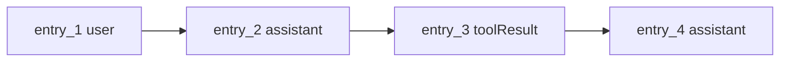

# Step 4：JSONL 会话

到目前为止，Agent 只能在一次请求里工作。JSONL session store 让它拥有可恢复的历史。

对应文件：

```text
examples/teaching-agent/src/server/agent/sessionStore.ts
```

## 这一步解决什么问题

Agent 每次请求模型都需要上下文。上下文不能只存在 React state 里，也不能只存在某次 HTTP 请求里。它要能：

1. 追加保存。
2. 重启恢复。
3. 从 leaf 构建当前分支。
4. 触发简化压缩。

## append-only entry

教学版 session 文件在：

```text
examples/teaching-agent/.teaching-agent/session.jsonl
```

每条消息 append 一行：

```json
{"type":"message","id":"entry_1","parentId":null,"timestamp":"...","message":{"role":"user","content":[{"type":"text","text":"列出工作区文件"}]}}
```

append-only 的好处是简单、稳定、崩溃友好。真实 Pi 也是这种思路。

## leaf 和 parentId

```ts
async appendMessage(message: AgentMessage): Promise<string> {
  const id = this.nextId();
  const entry = {
    type: "message",
    id,
    parentId: this.leafId,
    timestamp: new Date().toISOString(),
    message,
  };
  await this.appendEntry(entry);
  this.leafId = id;
  return id;
}
```

`leafId` 指向当前分支的末端。每次 append，新的 entry 的 `parentId` 指向旧 leaf，然后 leaf 前移。



## 从 leaf 构造上下文

```ts
private pathToLeaf(): SessionEntry[] {
  if (!this.leafId) return [];
  const path: SessionEntry[] = [];
  let current = this.byId.get(this.leafId);
  while (current) {
    path.unshift(current);
    current = current.parentId ? this.byId.get(current.parentId) : undefined;
  }
  return path;
}
```

教学版暂时没有 UI 分支选择器，但这个结构已经足够以后扩展 fork/tree。

## 简化 compaction

```ts
async compactIfNeeded(maxApproxTokens: number, keepRecentMessages: number) {
  const currentContext = this.buildContext();
  const tokensBefore = estimateTokens(currentContext);
  if (tokensBefore <= maxApproxTokens) return undefined;

  const kept = messageEntries.slice(-keepRecentMessages);
  const summarized = messageEntries.slice(0, -keepRecentMessages);
  const summary = summarizeEntries(summarized);

  return appendCompactionEntry(summary, kept[0].id, tokensBefore);
}
```

这不追求摘要质量，只保留结构：

| 字段 | 作用 |
| --- | --- |
| `summary` | 老上下文摘要 |
| `firstKeptEntryId` | 从哪条消息开始保留原文 |
| `tokensBefore` | 压缩前的近似 token |

## 运行检查

启动项目，连续发送几次：

```text
列出工作区文件
读取 README.md
写一条笔记
```

然后查看：

```bash
cat examples/teaching-agent/.teaching-agent/session.jsonl
```

你应该能看到 `session`、`message`，在上下文足够长时还能看到 `compaction`。

## 常见错误

| 错误 | 后果 |
| --- | --- |
| 每次保存整个 JSON 数组 | 长会话写入成本越来越高 |
| 恢复时不重建 byId | 无法从 leaf 回溯上下文 |
| 压缩时删除旧行 | 丢失审计和重建能力 |
| 把 compaction 当 assistant message 保存 | 类型语义混乱，后续无法区分摘要来源 |

## 小练习

把 `compactIfNeeded(1200, 8)` 中的 `1200` 改成 `300`，更容易触发压缩。观察前端 Event Timeline 里是否出现 `compaction`。

