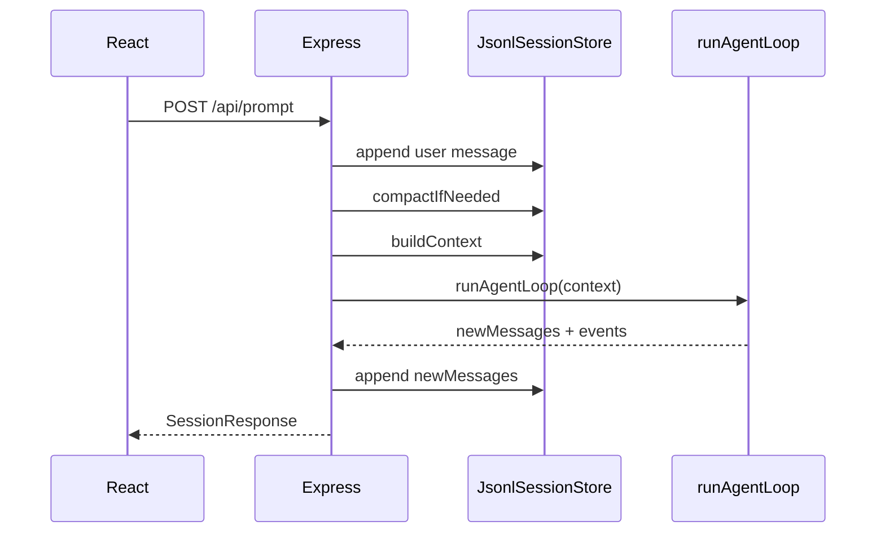

# Step 5：Express API

后端 API 是教学版 Agent 的 orchestrator。它连接 session store、loop、model、tools，并把结果返回给前端。

对应文件：

```text
examples/teaching-agent/src/server/index.ts
```

## 本节新增文件

```text
src/server/index.ts
```

如果你还没有前端，也可以只跑 API。本节完成后，Agent 已经可以通过 HTTP 工作。

## 三个接口

| 方法 | 路径 | 作用 |
| --- | --- | --- |
| `GET` | `/api/session` | 读取当前 session、tools、events |
| `POST` | `/api/prompt` | 追加用户消息并运行 Agent |
| `POST` | `/api/reset` | 清空教学会话 |

这是最小 API 面。真实 Pi 有 SDK、RPC、TUI、print mode，但核心都是在包装同一条 prompt 链路。

## POST /api/prompt 的顺序



代码上对应：

```ts
const userMessage = createUserMessage(input);
await store.appendMessage(userMessage);

const compaction = await store.compactIfNeeded(1200, 8);

const result = await runAgentLoop({
  systemPrompt,
  messages: store.buildContext(),
  tools: toolRegistry.definitions(),
  model,
  toolRegistry,
});

for (const message of result.newMessages) {
  await store.appendMessage(message);
}
```

这个顺序有一个细节：用户消息先进入 store，再构建上下文。否则模型看不到当前输入。

## 最小 API 骨架

```ts
import express from "express";

const app = express();
app.use(express.json());

app.get("/api/session", (_req, res) => {
  res.json(createResponse());
});

app.post("/api/prompt", async (req, res) => {
  const input = typeof req.body?.text === "string" ? req.body.text.trim() : "";
  if (!input) {
    res.status(400).json({ error: "text is required" });
    return;
  }

  const userMessage = createUserMessage(input);
  await store.appendMessage(userMessage);

  const result = await runAgentLoop({
    systemPrompt,
    messages: store.buildContext(),
    tools: toolRegistry.definitions(),
    model,
    toolRegistry,
  });

  for (const message of result.newMessages) {
    await store.appendMessage(message);
  }

  res.json(createResponse());
});

app.listen(4317);
```

完整文件还会处理 reset、eventLog 和 compaction。跟做时先让 `/api/prompt` 能返回消息，再补这些增强项。

## systemPrompt

教学版 system prompt 很短：

```ts
const systemPrompt = [
  "你是 Teaching Agent，一个用于解释 Pi Agent 核心机制的教学版 Agent。",
  "你可以使用工具观察安全工作区，也可以直接回答概念问题。",
  "当工具返回结果后，必须基于工具结果继续回答用户。",
].join("\n");
```

真实 Pi 的系统提示词要合并工具准则、扩展、技能索引、context files。教学版先保持短小，是为了让你看清控制流。

## 运行检查

启动 API：

```bash
npm run teaching-agent:dev
```

检查 session：

```bash
curl http://localhost:4317/api/session
```

提交 prompt：

```bash
curl -X POST http://localhost:4317/api/prompt \
  -H 'Content-Type: application/json' \
  -d '{"text":"列出工作区文件"}'
```

预期返回里包含：

- `tools`：三个工具定义。
- `messages`：user、assistant toolCall、toolResult、assistant final。
- `events`：turn、message、tool execution。

如果 `curl` 返回 `Cannot POST /api/prompt`，通常是 Express 没启动，或者你启动的是 Vite 前端端口而不是 API 端口。

## 常见错误

| 错误 | 后果 |
| --- | --- |
| prompt 接口里忘记 trim/校验输入 | 空消息进入 session |
| 先运行 loop 再 append 用户消息 | 模型看不到当前问题 |
| 把 eventLog 当作上下文来源 | 事件只是 UI 投影 |
| reset 只清前端不清 JSONL | 刷新页面后旧会话回来 |

## 小练习

给 `/api/session` 返回一个 `contextPreview` 字段，内容是 `store.buildContext()` 的消息数量和最后一条消息角色。这个练习能帮你调试“模型到底看到了什么”。

## 本节 checkpoint

```bash
git add src/server/index.ts
git commit -m "step 5: expose teaching agent api"
```
