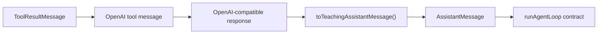
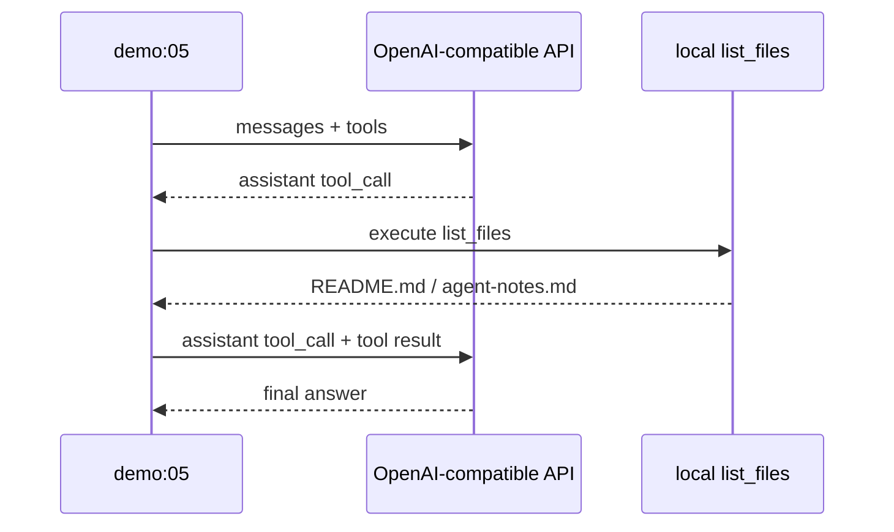
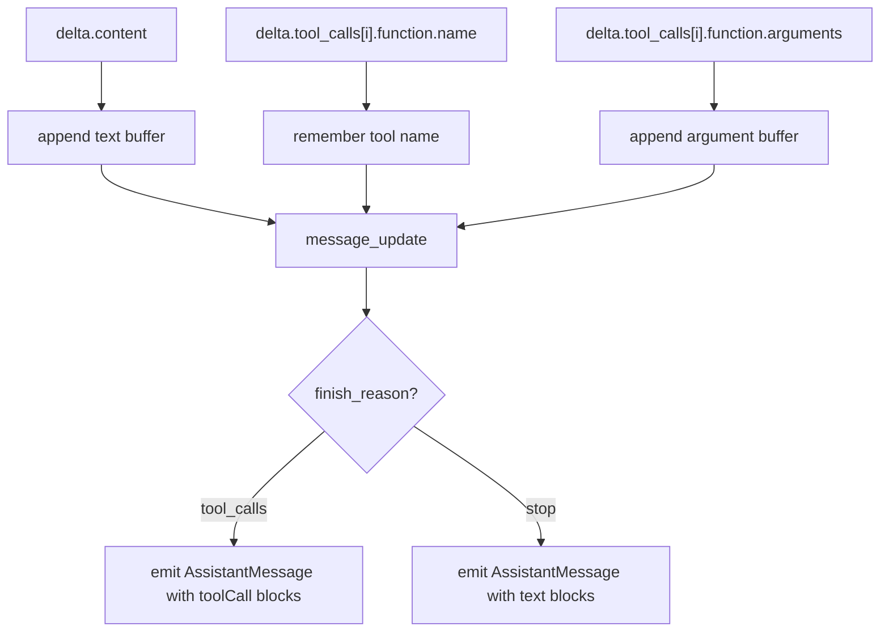

# 可选：接入 OpenAI-compatible 模型

教学版默认使用 `MockModel`，这样每个人不需要 API Key 也能跑通。但当你理解协议和 loop 后，可以用 OpenAI-compatible 接口做一次真实模型 smoke test，并进一步理解 provider adapter 应该放在哪一层。

Pi 官方 SDK 把 `AgentSession` 作为生命周期、消息历史、模型状态、压缩和事件流的管理对象；真实 provider 差异则被隔离在模型协议层。本节沿用这个边界：不要把 OpenAI-compatible 的字段直接塞进 Agent Loop，而是先转成教学版 `AssistantMessage`。

本仓库提供一个可选 Demo：

```bash
npm run demo:05
```

它不会读取仓库里的密钥文件，只从环境变量读取配置。
如果没有配置环境变量，脚本会打印用法并跳过，不会让普通 Demo 验证失败。

## 环境变量

| 变量 | 说明 |
| --- | --- |
| `OPENAI_COMPATIBLE_BASE_URL` | 例如 `https://example.com/v1` |
| `OPENAI_COMPATIBLE_API_KEY` | 模型 API Key，不要写进仓库 |
| `OPENAI_COMPATIBLE_MODEL` | 模型名，默认 `mimo-v2.5-pro` |
| `OPENAI_COMPATIBLE_AUTH_HEADER` | `api-key` 或 `authorization`，默认 `authorization` |

如果服务商使用 OpenAI 标准鉴权，一般是：

```bash
OPENAI_COMPATIBLE_AUTH_HEADER=authorization
```

如果服务商文档要求 `api-key` header，则使用：

```bash
OPENAI_COMPATIBLE_AUTH_HEADER=api-key
```

Xiaomi MiMo 文档里的 OpenAI-compatible 示例使用 `mimo-v2.5-pro` 和 `api-key` header；FAQ 也说明 `api-key` 与 `Authorization: Bearer` 都可以使用。

## 运行方式

```bash
OPENAI_COMPATIBLE_BASE_URL="https://example.com/v1" \
OPENAI_COMPATIBLE_API_KEY="你的 key" \
OPENAI_COMPATIBLE_MODEL="模型名" \
npm run demo:05
```

Demo 会做两件事：

1. 向 `/chat/completions` 发送一个带 `list_files` 工具定义的请求。
2. 如果模型返回 tool call，就在本地执行 `list_files`，再把 tool result 发回模型获取最终回答。

从工程角度看，它其实在演示一个小 adapter：





## 为什么不把它接进默认教学项目

| 原因 | 说明 |
| --- | --- |
| 可复现性 | MockModel 不需要网络和 key |
| 教学清晰度 | 初学者先理解 loop，不被 provider 细节打断 |
| 安全 | 默认项目不会要求保存密钥 |
| 边界稳定 | 真实模型输出存在不确定性，Demo 适合 smoke test |

真实项目里，你可以把 `MockModel.complete()` 替换成 OpenAI-compatible adapter。只要它最终返回教学版的 `AssistantMessage`，loop、工具和会话都不用重写。

## 非流式 adapter 怎么写

OpenAI-compatible 的 assistant message 大致长这样：

```ts
type OpenAIAssistant = {
  content?: string | null;
  tool_calls?: Array<{
    id: string;
    type: "function";
    function: {
      name: string;
      arguments: string;
    };
  }>;
};
```

教学版需要的是：

```ts
type AssistantMessage = {
  role: "assistant";
  content: Array<TextContent | ToolCallContent>;
  stopReason: "stop" | "toolUse" | "error" | "aborted";
};
```

转换规则：

| Provider 字段 | 教学版字段 | 注意 |
| --- | --- | --- |
| `content` | `{ type: "text", text }` | `null` 时不要生成空文本块 |
| `tool_calls[].id` | `ToolCallContent.id` | 后续 tool result 必须用这个 id 对齐 |
| `tool_calls[].function.name` | `ToolCallContent.name` | 必须和本地 `ToolRegistry` 名称一致 |
| `tool_calls[].function.arguments` | `ToolCallContent.arguments` | 先 `JSON.parse`，失败时转成错误工具结果 |
| `finish_reason === "tool_calls"` | `stopReason: "toolUse"` | 有些 provider 不完全一致，所以也要看 `tool_calls.length` |

Demo 5 里的核心函数就是：

```ts
function toTeachingAssistantMessage(message, finishReason): AssistantMessage {
  const toolCalls = (message.tool_calls ?? []).map((call) => ({
    type: "toolCall",
    id: call.id,
    name: call.function.name,
    arguments: safeJsonParse(call.function.arguments),
  }));

  return {
    role: "assistant",
    content: [
      ...(message.content ? [{ type: "text", text: message.content }] : []),
      ...toolCalls,
    ],
    stopReason: finishReason === "tool_calls" || toolCalls.length > 0 ? "toolUse" : "stop",
    usage: { input: 0, output: 0, totalTokens: 0 },
    timestamp: Date.now(),
  };
}
```

这一步就是 Pi 的 `pi-ai` 思想缩影：provider 字段只在 adapter 里出现，Agent Loop 只看统一协议。

## tool result 如何回传给 provider

教学版工具执行完得到 `ToolResultMessage`：

```ts
{
  role: "toolResult",
  toolCallId: "call_123",
  toolName: "list_files",
  content: [{ type: "text", text: "README.md" }],
  isError: false
}
```

OpenAI-compatible 下一轮要看到的是 `tool` message：

```ts
{
  role: "tool",
  tool_call_id: "call_123",
  content: "README.md"
}
```

这里最重要的是 `tool_call_id`。如果丢了，模型就不知道这个工具结果对应哪一次调用。

## 流式 delta 怎么拼

真实产品通常不会等完整 response，而是消费 stream。你可以把流式 adapter 想成一个 builder：



最容易错的是 tool arguments：流式返回时它可能是一段段 JSON 字符串，不能每次 delta 都 `JSON.parse`。正确做法是先按 `tool_call.id/index` 累积，finish 后再 parse。

## 错误和 abort 怎么收尾

| 场景 | Adapter 应该返回什么 |
| --- | --- |
| provider HTTP 401/429/500 | `AssistantMessage.stopReason = "error"`，`errorMessage` 写明状态码和摘要 |
| tool arguments JSON 解析失败 | 生成 `isError: true` 的 tool result，让模型有机会修正 |
| 用户 abort 模型请求 | `stopReason = "aborted"`，同时停止后续工具执行 |
| 网络中途断流 | 把已累积文本作为 partial 信息，最终仍发 `message_end` 或错误事件 |

真实 Pi 会把这些情况整理成稳定事件流，避免 UI、session 和工具状态卡在半截。

## 与 AgentSession 的关系

不要把 adapter 写成“直接操作会话”的大函数。比较稳的边界是：

| 层 | 应该做什么 |
| --- | --- |
| Adapter | provider request/response 与统一消息协议互转 |
| Agent Loop | 根据 `AssistantMessage` 决定是否执行工具 |
| API / AgentSession | 管 session、压缩、事件订阅、持久化 |

这也是 Pi 官方 SDK 强调 `AgentSession` 的原因：模型状态、消息历史、压缩和事件流是运行层职责，不应该泄漏到 provider adapter。

## 常见错误

| 错误 | 修正 |
| --- | --- |
| 把 key 写入 `package.json` script | 用环境变量传入 |
| base URL 多写 `/chat/completions` | 只填到 `/v1`，Demo 会拼接路径 |
| provider 使用 `api-key`，但你用了 Bearer | 设置 `OPENAI_COMPATIBLE_AUTH_HEADER=api-key` |
| 模型没有返回 tool call | 先看 Demo 输出的 assistant content，再调整 prompt 或模型名 |
| tool arguments JSON 解析失败 | 把失败包装成 `isError` tool result，不要让进程直接崩 |
| 流式 tool arguments 每段都 parse | 先累积字符串，finish 后再 parse |

## 小练习

把 Demo 里的 `list_files` 改成 `read_file`，让真实模型先读取 `agent-notes.md`，再总结其中的 Agent Loop 定义。
