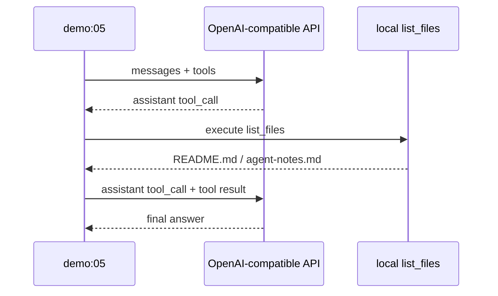

# 可选：接入 OpenAI-compatible 模型

教学版默认使用 `MockModel`，这样每个人不需要 API Key 也能跑通。但当你理解协议和 loop 后，可以用 OpenAI-compatible 接口做一次真实模型 smoke test。

本仓库提供一个可选 Demo：

```bash
npm run demo:05
```

它不会读取仓库里的密钥文件，只从环境变量读取配置。
如果没有配置环境变量，脚本会打印用法并跳过，不会让普通 Demo 验证失败。

## 环境变量

| 变量 | 说明 |
| --- | --- |
| `OPENAI_COMPATIBLE_BASE_URL` | 例如 `https://example.com/v1` |
| `OPENAI_COMPATIBLE_API_KEY` | 模型 API Key，不要写进仓库 |
| `OPENAI_COMPATIBLE_MODEL` | 模型名，默认 `mimo-v2.5-pro` |
| `OPENAI_COMPATIBLE_AUTH_HEADER` | `api-key` 或 `authorization`，默认 `authorization` |

如果服务商使用 OpenAI 标准鉴权，一般是：

```bash
OPENAI_COMPATIBLE_AUTH_HEADER=authorization
```

如果服务商文档要求 `api-key` header，则使用：

```bash
OPENAI_COMPATIBLE_AUTH_HEADER=api-key
```

Xiaomi MiMo 文档里的 OpenAI-compatible 示例使用 `mimo-v2.5-pro` 和 `api-key` header；FAQ 也说明 `api-key` 与 `Authorization: Bearer` 都可以使用。

## 运行方式

```bash
OPENAI_COMPATIBLE_BASE_URL="https://example.com/v1" \
OPENAI_COMPATIBLE_API_KEY="你的 key" \
OPENAI_COMPATIBLE_MODEL="模型名" \
npm run demo:05
```

Demo 会做两件事：

1. 向 `/chat/completions` 发送一个带 `list_files` 工具定义的请求。
2. 如果模型返回 tool call，就在本地执行 `list_files`，再把 tool result 发回模型获取最终回答。



## 为什么不把它接进默认教学项目

| 原因 | 说明 |
| --- | --- |
| 可复现性 | MockModel 不需要网络和 key |
| 教学清晰度 | 初学者先理解 loop，不被 provider 细节打断 |
| 安全 | 默认项目不会要求保存密钥 |
| 边界稳定 | 真实模型输出存在不确定性，Demo 适合 smoke test |

真实项目里，你可以把 `MockModel.complete()` 替换成 OpenAI-compatible adapter。只要它最终返回教学版的 `AssistantMessage`，loop、工具和会话都不用重写。

## 常见错误

| 错误 | 修正 |
| --- | --- |
| 把 key 写入 `package.json` script | 用环境变量传入 |
| base URL 多写 `/chat/completions` | 只填到 `/v1`，Demo 会拼接路径 |
| provider 使用 `api-key`，但你用了 Bearer | 设置 `OPENAI_COMPATIBLE_AUTH_HEADER=api-key` |
| 模型没有返回 tool call | 先看 Demo 输出的 assistant content，再调整 prompt 或模型名 |

## 小练习

把 Demo 里的 `list_files` 改成 `read_file`，让真实模型先读取 `agent-notes.md`，再总结其中的 Agent Loop 定义。
