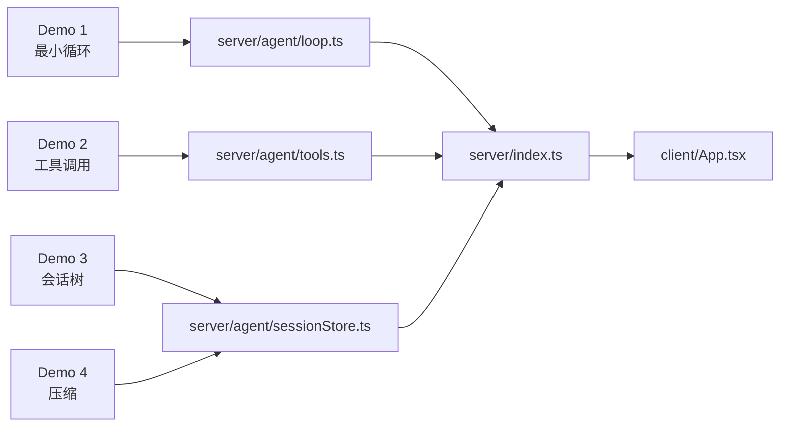

# Demo 到项目的映射

四个 Demo 不是孤立练习。它们分别对应教学版 Agent 后端里的四块机制。读者可以先在小文件里理解机制，再到最终项目里看它如何和 API、前端、会话存储接起来。

## 总览

## 对照表

| Demo | 学到的最小机制 | 最终项目中的位置 |
| --- | --- | --- |
| Demo 1 | 用户消息进入上下文，模型生成助手消息，事件驱动输出 | `runAgentLoop()` 负责 turn、message lifecycle 和 `agent_end` |
| Demo 2 | assistant 产出 `toolCall`，运行时执行工具，结果回写为 `toolResult` | `ToolRegistry` 和 `executeToolCall()` |
| Demo 3 | session entry 用 `id`/`parentId` 形成树，`leafId` 决定上下文路径 | `JsonlSessionStore.appendMessage()` 和 `buildContext()` |
| Demo 4 | 旧消息被摘要替代，最近消息保留原文 | `JsonlSessionStore.compactIfNeeded()` |

## 从 Demo 读到最终项目

建议按这个顺序打开文件：

1. `examples/demos/01-loop.ts`
2. `examples/teaching-agent/src/server/agent/loop.ts`
3. `examples/demos/02-tools.ts`
4. `examples/teaching-agent/src/server/agent/tools.ts`
5. `examples/demos/03-session-tree.ts`
6. `examples/teaching-agent/src/server/agent/sessionStore.ts`
7. `examples/demos/04-compaction.ts`
8. `examples/teaching-agent/src/server/index.ts`

这样读的好处是：每次只迁移一个概念。先把机制看懂，再看它如何被 Express API 串起来。

## 最终项目多了什么

Demo 故意很小，所以最终项目额外补了这些 glue code：

| 增量 | 为什么需要 |
| --- | --- |
| Express API | 让浏览器能提交 prompt、重置会话、读取状态 |
| React UI | 同时观察消息、工具和事件时间线 |
| 安全工作区 | 工具只能读写 `workspace/`，避免路径越界 |
| 共享协议类型 | 前后端都使用同一套 `AgentMessage`、`AgentEvent`、`ToolDefinition` |
| MockModel 策略 | 不依赖 API Key，也能稳定复现工具调用链路 |

## 小练习

把 Demo 2 的 `read_note` 工具迁移到最终项目中，作为第四个工具 `read_note`。完成后你需要改三处：

1. 在 `ToolRegistry` 注册工具。
2. 在 `MockModel` 中决定什么时候调用它。
3. 在前端工具列表中确认它自动出现。
