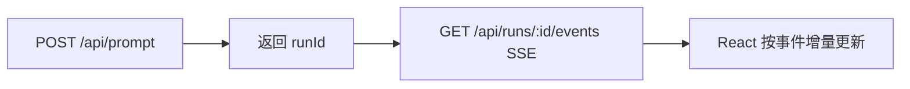

# 扩展方向

把教学版跑通以后，你可以沿着 Pi 的真实方向继续扩展。

## 接入真实模型

替换 `MockModel` 是第一步。你需要解决：

| 问题 | 提示 |
| --- | --- |
| 工具 schema 怎么传给模型 | 选择供应商的 tool/function calling 协议 |
| 流式事件怎么统一 | 把供应商事件转成自己的 `AgentEvent` |
| 错误怎么表达 | 不要直接 throw，尽量转成 `AssistantMessage.stopReason = "error"` |
| token 用量怎么记录 | 保存到 assistant message，方便压缩判断 |

## 做真正的流式 UI

当前前端是请求结束后一次性展示。下一步可以改成：



## 扩展工具

可以新增：

| 工具 | 学到的机制 |
| --- | --- |
| `grep_files` | 大输出截断 |
| `edit_file` | diff、写入审批 |
| `run_command` | 超时、中止、危险命令拦截 |
| `web_fetch` | 网络错误、HTML 转文本 |
| `ask_user` | 工具反向请求用户输入 |

## 加入权限系统

Pi 的扩展可以在工具执行前拦截。教学版可以先做一个简单 hook：

```ts
beforeToolCall: async (call) => {
  if (call.name === "write_note" && call.arguments.fileName.includes("secret")) {
    return { block: true, reason: "protected path" };
  }
}
```

## 加入会话树 UI

后端已经保存了 `id` 和 `parentId`。你可以新增一个 Tree 视图：

1. 从 `/api/session` 返回所有 entries。
2. 前端按 `parentId` 构建树。
3. 点击节点时调用 `/api/branch` 切换 leaf。
4. 下一次 prompt 从该 leaf 继续。

## 学习 Pi 源码的下一步

当你完成这些扩展，再去读 Pi 真实源码会轻松很多。推荐顺序：

1. `packages/agent/src/agent-loop.ts`
2. `packages/agent/src/agent.ts`
3. `packages/coding-agent/src/core/agent-session.ts`
4. `packages/coding-agent/src/core/session-manager.ts`
5. `packages/coding-agent/src/core/extensions/`
