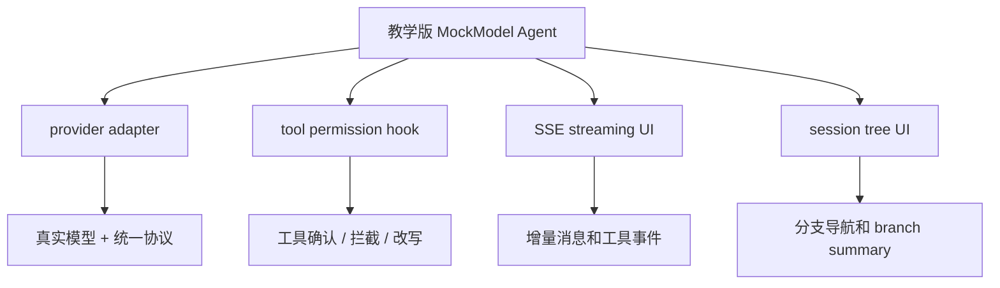

# 扩展方向

把教学版跑通以后，不要急着把它改成“什么都能做”的大项目。更稳的方式是沿着 Pi 的真实工程边界逐步扩展：模型适配层、工具权限层、事件流、会话树 UI 和失败保护。

本页给你工程草图，不要求一次性实现。每个方向都包含最小接口、关键状态、实现步骤和风险提示。

## 先看扩展路线



事实核对口径：

| Pi 真实能力 | 官方入口 | 教学版扩展时怎么映射 |
| --- | --- | --- |
| 模型供应商差异隔离在 `pi-ai` | [SDK](https://pi.dev/docs/latest/sdk) 与 `packages/ai/src/providers/*` | 新增 adapter，不把 OpenAI/Anthropic 分支写进 loop |
| 扩展可监听 `tool_call` / `tool_result` | [Extensions](https://pi.dev/docs/latest/extensions) | 教学版可以先实现本地 `beforeToolCall` hook |
| `AgentSession.subscribe()` 接收事件流 | [SDK](https://pi.dev/docs/latest/sdk) | 后端用 SSE 推送 `AgentEvent` |
| 会话是 JSONL entry tree | [Session Format](https://pi.dev/docs/latest/session-format) | 前端按 `id` / `parentId` 渲染树 |
| 切分支可生成 branch summary | [Compaction](https://pi.dev/docs/latest/compaction#branch-summarization) | 先做 UI 分支，再把 branch summary 作为进阶练习 |

## 1. Provider adapter：为什么不要直接在 loop 里写供应商分支

接入真实模型时，最诱人的写法是在 `runAgentLoop()` 里判断：

```ts
if (provider === "openai") {
  // parse tool_calls
} else if (provider === "anthropic") {
  // parse tool_use
}
```

这个写法很快会失控。工具调用格式、流式 delta、错误结构、token usage、abort 语义都不一样，一旦它们进了 loop，核心闭环就会被 provider 细节污染。

更好的边界是：

```ts
export interface TeachingModel {
  complete(input: {
    systemPrompt: string;
    messages: AgentMessage[];
    tools: ToolDefinition[];
    signal?: AbortSignal;
  }): Promise<AssistantMessage>;
}
```

然后分别实现：

| 实现 | 职责 |
| --- | --- |
| `MockModel` | 稳定、可测试、无网络依赖 |
| `OpenAICompatibleModel` | `tool_calls` / `tool` message / `finish_reason` 转教学版协议 |
| `AnthropicModel` | 将 content blocks、tool_use、tool_result 转教学版协议 |

Pi 的 `pi-ai` 就是在做这件事：把 provider 输入输出整理成统一消息和事件，让 Agent Loop 只关心“assistant 是否请求工具、工具结果如何回写、什么时候停止”。

当前教学版已经抽出了 `TeachingModel` 接口，`MockModel` 只是这个接口的一个实现。

推荐你先读 [可选：接入 OpenAI-compatible 模型](/project/build-08-real-model)，再考虑把 Demo 5 的 adapter 移进教学版后端。

## 2. 工具权限模型：确认、拦截、参数改写

Pi 真实扩展系统里，工具执行前后可以通过 `tool_call`、`tool_result` 等事件做干预。教学版可以先实现一个更小的 hook：`beforeToolCall`。

最小接口：

```ts
type ToolDecision =
  | { action: "allow" }
  | { action: "block"; reason: string }
  | { action: "rewrite"; args: Record<string, unknown>; reason?: string }
  | { action: "confirm"; prompt: string };

type BeforeToolCall = (call: {
  id: string;
  name: string;
  arguments: Record<string, unknown>;
}) => Promise<ToolDecision>;
```

实现位置放在 `executeToolCall()` 前：

```ts
const decision = await beforeToolCall?.(toolCall);

if (decision?.action === "block") {
  return errorToolResult(toolCall, decision.reason);
}

const args = decision?.action === "rewrite" ? decision.args : toolCall.arguments;
const result = await toolRegistry.execute(toolCall.name, args);
```

关键状态：

| 状态 | UI 怎么表现 |
| --- | --- |
| `allow` | 直接执行工具 |
| `block` | 展示被拦截原因，生成 `isError` toolResult |
| `rewrite` | 展示原参数和改写后参数 |
| `confirm` | 暂停 run，前端弹出确认，再继续 |

第一版可以只做 `allow/block/rewrite`，把 `confirm` 留到有 SSE 之后。因为确认需要后端 run 暂停、前端回复、再恢复执行，比普通同步 hook 多一个运行态。

当前教学版已经实现了 `allow/block/rewrite` 的最小版本：`write_note` 写入包含 `secret` 或 `秘密` 的文件名会被 block，`list_files` 缺少 `path` 时会被 rewrite 成 `"."`。

常见规则：

| 工具 | 规则示例 |
| --- | --- |
| `write_note` | 文件名不能包含 `secret`、绝对路径和上级目录 |
| `read_file` | 大文件先截断，敏感文件直接 block |
| `run_command` | `rm -rf`、`curl | sh` 默认 confirm 或 block |
| `web_fetch` | 限制域名和响应大小 |

风险提示：权限 hook 不应该只在前端做。前端确认可以改善体验，但真正的拦截必须在后端工具执行前完成。

## 3. 真正流式 UI：用 SSE 推事件

当前教学版是 `POST /api/prompt` 等 loop 跑完后一次性返回。下一步可以改成两段式：

```mermaid
sequenceDiagram
  participant UI as React UI
  participant API as Express API
  participant Loop as runAgentLoop
  participant Model as Model Adapter
  participant Tools as ToolRegistry

  UI->>API: POST /api/runs { text }
  API-->>UI: { runId }
  UI->>API: GET /api/runs/:runId/events
  API->>Loop: runAgentLoop(onEvent)
  Loop->>Model: complete / stream
  Model-->>Loop: message_update
  Loop-->>API: AgentEvent
  API-->>UI: SSE event
  Loop->>Tools: execute tool
  Tools-->>Loop: toolResult
  Loop-->>API: tool_execution_end
  API-->>UI: SSE event
```

后端事件格式可以直接复用 `AgentEvent`：

```ts
function sendEvent(res: Response, event: AgentEvent) {
  res.write(`event: ${event.type}\n`);
  res.write(`data: ${JSON.stringify(event)}\n\n`);
}
```

前端状态不要等最终消息才更新：

```ts
const source = new EventSource(`/api/runs/${runId}/events`);

source.addEventListener("message_update", (event) => {
  const payload = JSON.parse(event.data) as AgentEvent;
  appendDelta(payload);
});

source.addEventListener("tool_execution_start", (event) => {
  markToolRunning(JSON.parse(event.data));
});
```

关键状态：

| 状态 | React 里建议怎么存 |
| --- | --- |
| 正在生成的 assistant message | `draftAssistantById` |
| 工具运行中 | `runningTools: Record<toolCallId, ToolState>` |
| 已完成消息 | `messages` |
| 错误或中止 | `runStatus: "idle" | "running" | "error" | "aborted"` |

风险提示：

| 风险 | 处理 |
| --- | --- |
| 浏览器断开 SSE | 后端监听 `req.on("close")`，触发 abort |
| 消息 delta 乱序 | 每个 message/toolCall 带稳定 id |
| 工具结果很大 | 后端先截断，再发 `tool_execution_end` |
| 事件重复 | 前端按 event id 或 message id 幂等更新 |

## 4. 会话树 UI：让 `id / parentId / leafId` 被看见

教学版已经保存 `id` 和 `parentId`，但 UI 还只展示当前上下文。你可以做一个树视图，把 session 文件里的结构可视化。

最小 API：

```ts
GET /api/session
// 已有：返回 entries

POST /api/branch
// body: { leafId: string }
// effect: 切换当前 leaf，下一次 prompt 从该节点继续
```

前端构树：

```ts
type TreeNode = {
  id: string;
  label: string;
  children: TreeNode[];
};

function buildTree(entries: SessionEntry[]): TreeNode[] {
  const nodes = new Map<string, TreeNode>();
  const roots: TreeNode[] = [];
  // 1. 为 message / compaction entry 建节点
  // 2. 按 parentId 挂到父节点
  // 3. parentId 为空的节点进 roots
  return roots;
}
```

UI 最小交互：

| 操作 | 后端行为 | 前端反馈 |
| --- | --- | --- |
| 点击节点 | `POST /api/branch` | 高亮新的 leaf |
| 从节点继续提问 | 新 message 的 `parentId` 指向该 leaf | 树上长出新分支 |
| 切走长分支 | 可选生成 branch summary | 时间线显示 summary entry |

第一版不要急着做 branch summary。先确认“点击节点 -> 切 leaf -> 下一条 prompt 从该 leaf 生长”成立，再补摘要。这样读者能清楚区分 tree navigation 和 compaction。

## 5. Agent 失败模式清单

Agent 工程的难点不在 happy path，而在这些边界：

| 失败模式 | 症状 | 最小保护 |
| --- | --- | --- |
| 无限 tool call | 模型一直调用同一个工具 | `maxTurns`、预算、重复工具检测 |
| 工具输出过长 | 下一轮 prompt 爆上下文 | 工具结果截断、附件化、compaction |
| 模型不调用工具 | 用户要读文件，模型直接编 | system prompt 明确工具职责，UI 标出未使用工具 |
| 工具参数 JSON 错误 | provider 返回不可解析参数 | adapter 捕获并生成 `isError` toolResult |
| 工具不存在 | 工具名拼错或没注册 | registry 返回错误 toolResult |
| provider 超时/断流 | UI 一直 loading | `AbortController`、超时、`stopReason: "aborted"` |
| 用户中途取消 | 后端仍在跑工具 | 请求 close 时 abort 模型和工具 |
| 路径越界 | 模型传 `../secret` | 后端 workspace guard |
| 多次提交并发 | 两个 run 同时写 session | per-session run lock 或队列 |
| 压缩摘要丢关键事实 | 后续模型忘了刚改的文件 | 保留最近消息、记录文件 read/write details |

这些保护不是“生产级才需要”。教学版已经实现了其中几条：`maxTurns`、未知工具变 `isError`、路径越界拦截、工具输出截断和简化 compaction。扩展时优先补你当前最容易踩的那一条。

## 6. 推荐实现顺序

1. 抽出 `TeachingModel` 接口，让 `MockModel` 和真实 adapter 都实现它。（已在教学版实现）
2. 给 `runAgentLoop()` 加 `beforeToolCall`，先支持 `allow/block/rewrite`。（已在教学版实现）
3. 把 `POST /api/prompt` 改成 `POST /api/runs` + SSE events。（已在教学版实现，`/api/prompt` 保留为兼容接口）
4. 前端把一次性消息列表改成增量消息状态。（已在教学版实现）
5. 暴露 `/api/branch`，做最小会话树 UI。（已在教学版实现）
6. 有树 UI 后，再补 branch summary 和更细的 compaction details。

## 学习 Pi 源码的下一步

当你完成这些扩展，再去读 Pi 真实源码会轻松很多。推荐顺序：

1. `packages/ai/src/types.ts` 与 `packages/ai/src/providers/*`
2. `packages/agent/src/agent-loop.ts`
3. `packages/agent/src/agent.ts`
4. `packages/coding-agent/src/core/agent-session.ts`
5. `packages/coding-agent/src/core/extensions/`
6. `packages/coding-agent/src/core/session-manager.ts`
7. `packages/coding-agent/src/core/compaction/`

读的时候记住一个判断标准：如果某段代码是在隔离 provider 差异、保护工具边界、恢复 session 上下文或维持事件流，那它大概率不是“复杂化”，而是在替你挡真实 Agent 会遇到的麻烦。
