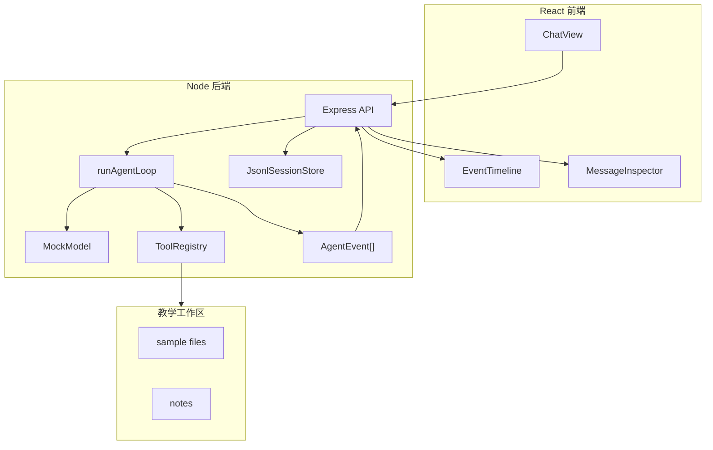
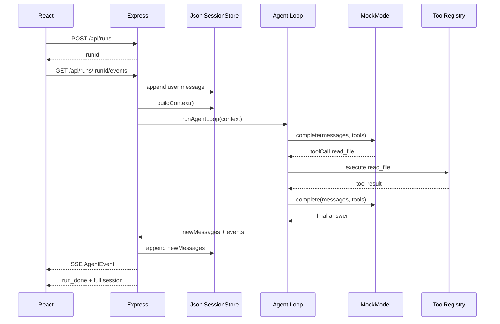

# 教学版目标项目总览

最终项目是一个简化版 Pi Agent，技术栈是 React + Node.js + TypeScript。

它不是 Pi 的复制品，而是一个适合学习的缩小模型。你可以把它看作“Pi 核心思想的教学沙盘”。

## 功能目标

| 功能 | 是否实现 | 说明 |
| --- | --- | --- |
| 聊天输入 | 是 | React 页面输入用户目标 |
| Agent Loop | 是 | 后端循环处理模型输出和工具调用 |
| 工具注册 | 是 | `list_files`、`read_file`、`write_note` |
| 工具结果回写 | 是 | 生成 `toolResult` 消息再进入下一轮 |
| 事件时间线 | 是 | 前端展示 message/tool/turn 事件 |
| JSONL 会话 | 是 | 后端追加写 `.teaching-agent/session.jsonl` |
| 会话树 | 最小实现 | 保存 `id` / `parentId` / `leafId` |
| 上下文压缩 | 简化实现 | 超过阈值时插入 summary message |
| 真实模型 API | 可选 Demo | 默认用 `MockModel`，`npm run demo:05` 展示 OpenAI-compatible 接入 |

## 架构



## 一次请求的后端流程



`POST /api/prompt` 仍然保留，方便 curl 调试；浏览器默认使用 `/api/runs` + SSE，这样读者能看到消息和工具事件逐步进入 UI。

## 为什么先用 MockModel

教学项目不直接接真实模型，是为了让每个读者都能在没有 API Key 的情况下跑通。

`MockModel` 的另一个好处是可预测：你知道它什么时候会调用工具，什么时候会停止。等你理解 Agent Loop 后，再把它替换成 OpenAI/Anthropic/Vercel AI SDK 都不难。

如果你已经有 OpenAI-compatible 测试接口，可以先看 [可选：接入 OpenAI-compatible 模型](/project/build-08-real-model)。这条路径不会改变默认教学项目，只用于验证真实模型如何接入同一套工具协议。

## 目录

```text
examples/teaching-agent/
├─ src/
│  ├─ client/               # React 前端
│  ├─ server/
│  │  ├─ agent/             # loop、model、tools、session store
│  │  └─ index.ts           # Express API
│  └─ shared/               # 前后端共享类型
├─ workspace/               # 工具可访问的示例文件
├─ package.json
├─ tsconfig.json
└─ vite.config.ts
```

## 和前面 Demo 的关系

如果你已经跑过四个 Demo，可以把最终项目看成它们的组合版：

| 机制 | Demo | 最终项目 |
| --- | --- | --- |
| 最小 Agent Loop | Demo 1 | `src/server/agent/loop.ts` |
| 工具调用 | Demo 2 | `ToolRegistry` + `MockModel` |
| 会话树 | Demo 3 | `JsonlSessionStore` |
| 上下文压缩 | Demo 4 | `compactIfNeeded()` |

更细的文件对照见 [Demo 到项目的映射](/project/code-map)。
