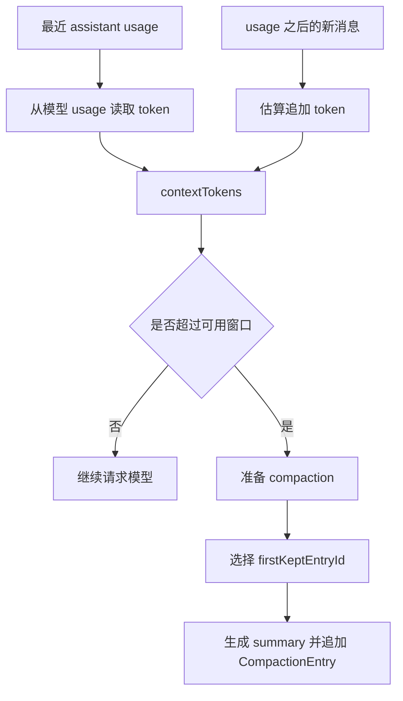
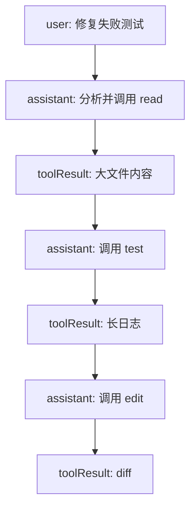

# 进阶：真实 Pi 为什么压缩更复杂

前面的压缩页把主线讲成“摘要旧消息 + 保留最近消息”。这个模型对教学版足够好，因为它能让你先抓住两个核心不变量：

1. 原始 session 历史不删除。
2. 后续模型上下文由 summary 和 recent messages 重新拼出来。

但真实 Pi 面对的是更麻烦的工程问题：模型上下文窗口有限，工具输出可能很长，用户可能在会话树里跳分支，一个巨大 turn 可能自己就超过保留预算，扩展还可能接管压缩。官方 Compaction 文档和 `packages/coding-agent/src/core/compaction/` 源码把这些边界都显式处理了。

## 事实核对

| 结论 | 官方文档 / 源码位置 | 教学时怎么理解 |
| --- | --- | --- |
| 自动压缩触发条件是 `contextTokens > contextWindow - reserveTokens` | [Compaction 文档](https://pi.dev/docs/latest/compaction) 与 `compaction.ts` | 压缩不是按消息条数触发，而是给下一次模型回复预留空间 |
| 当前默认 `reserveTokens` 为 `16384`，`keepRecentTokens` 为 `20000` | [Compaction Settings](https://pi.dev/docs/latest/compaction#settings) | 一个控制“要留多少输出空间”，一个控制“最近原文保留多少” |
| `CompactionEntry` 记录 `summary`、`firstKeptEntryId`、`tokensBefore` 和可选 `details` | [Session Format](https://pi.dev/docs/latest/session-format) | summary 不是孤立文本，它带着恢复上下文所需的边界指针 |
| Pi 通常在 turn 边界切分，且不会在 `toolResult` 处切 | [Cut Point Rules](https://pi.dev/docs/latest/compaction#cut-point-rules) | 工具调用和工具结果必须保持语义连续 |
| split turn 会额外摘要这个 turn 的前半段 | [Split Turns](https://pi.dev/docs/latest/compaction#split-turns) | 一个超长 turn 不能简单整段保留或整段丢给历史摘要 |
| branch summary 发生在 `/tree` 切换分支时，解决的问题不同于 compaction | [Branch Summarization](https://pi.dev/docs/latest/compaction#branch-summarization) | compaction 是同一路径减重，branch summary 是换路径时带走经验 |
| 默认摘要会累计文件读写信息 | [Cumulative File Tracking](https://pi.dev/docs/latest/compaction#cumulative-file-tracking) | 代码 Agent 需要知道哪些文件被读过、改过，而不只是聊天摘要 |

这些细节不是为了炫技。它们共同解决一个问题：压缩后，模型看到的上下文必须仍然像“连续工作现场”，而不是一段抽象回忆录。

## 触发条件：不是消息多，而是预算不够

教学版可以用“上下文字符串长度超过阈值”模拟压缩。真实 Pi 更接近下面这个流程：



公式是：

```ts
contextTokens > contextWindow - reserveTokens
```

这里的 `reserveTokens` 很关键。Agent 不是只要“输入塞得下”就行，还要给模型回复、工具调用参数和后续事件留空间。否则模型刚开始输出就可能撞上下文限制。

`keepRecentTokens` 解决另一个问题：哪些内容必须保留原文。最近的报错、工具输出、用户补充约束常常非常具体，过早摘要会损失细节。

## firstKeptEntryId 是恢复指针

很多人第一次实现压缩，会只保存一个 `summary` 字段。这样页面能展示，但恢复上下文时会立刻遇到问题：summary 后面到底从哪条原文消息接上？

Pi 用 `firstKeptEntryId` 明确这个边界。

| 字段 | 作用 | 没有它会怎样 |
| --- | --- | --- |
| `summary` | 旧上下文摘要 | 只能知道大概发生过什么 |
| `firstKeptEntryId` | 后续原文从哪个 entry 开始保留 | 重建上下文时可能重复消息，也可能漏掉消息 |
| `tokensBefore` | 压缩前上下文 token 规模 | 无法在 UI、日志和扩展里解释这次压缩替换了多少上下文 |
| `details` | 默认可保存读写文件等实现细节 | 摘要只剩自然语言，丢掉代码工作现场的结构化线索 |

可以把压缩后的上下文想成：

```text
system prompt
compaction summary
messages from firstKeptEntryId to current leaf
```

注意：JSONL 文件里旧消息仍然存在。`firstKeptEntryId` 只是告诉运行时“下次喂给模型时从哪里接回原文”。

## cut point：为什么不能随便切

工具调用让切分变复杂了。一次工具调用不是单条消息，而是至少包含：

1. assistant 发出 `toolCall`。
2. tool 执行并生成 `toolResult`。
3. assistant 读取结果后继续回答。

如果压缩刚好切在 `toolResult` 前后，模型可能看到一个没有来源的工具结果，或者看到一个没有结果的工具调用。这会破坏对话协议。


官方规则里，合法 cut point 可以是用户消息、assistant 消息、bashExecution、自定义消息或 branch summary，但不会切在 tool result 上。直觉上讲：可以从一轮的起点接上，也可以从 assistant 的一个稳定输出点接上，但不能把“工具调用和结果”拆成孤儿。

## split turn：一个 turn 自己太大怎么办

通常一个 turn 从用户消息开始，到下一条用户消息前结束。理想情况下，压缩在 turn 边界上切：旧 turn 摘要掉，新 turn 保留原文。

但代码 Agent 经常遇到一个超长 turn：



如果这个 turn 已经超过 `keepRecentTokens`，Pi 不能简单说“整个 turn 都保留”。这时 cut point 会落在 turn 内部，形成 split turn。真实实现会把 turn 前半段作为 `turnPrefixMessages` 单独摘要，再把后半段原文保留下来。

这一步保护的是连续性：模型仍能知道这个巨大 turn 前面做了什么，同时不会把整个巨大工具输出都塞进下一轮请求。

## 重复压缩：摘要也会成为历史

长会话不会只压缩一次。第二次、第三次压缩时，Pi 需要处理之前已经存在的 compaction entry。

核心原则是：下一次摘要的范围从上一次保留边界附近继续算，而不是简单从上一个 compaction entry 后面开始。官方文档说明，重复压缩会从前一次 `firstKeptEntryId` 的保留边界开始处理；如果找不到该 entry，则退回到前一个 compaction 后的 entry。

这样做的原因很实在：上一次被“保留原文”的消息，下一次可能已经变旧了，也应该有机会进入新的 summary。否则最近上下文会越滚越大，压缩效果越来越差。

## branch summary：它不是压缩

`branch_summary` 和 `compaction` 都是摘要，但触发场景完全不同。

| 维度 | compaction | branch summary |
| --- | --- | --- |
| 触发 | 上下文超过阈值，或用户运行 `/compact` | 用户在 `/tree` 中切换到另一条分支 |
| 摘要对象 | 当前路径上的旧上下文 | 正在离开的分支，从旧 leaf 到共同祖先 |
| 目标 | 减少 token 占用 | 把离开分支的重要发现带到新位置 |
| 写入 entry | `type: "compaction"` | `type: "branch_summary"` |
| 恢复方式 | summary + `firstKeptEntryId` 后的原文 | 作为 branch summary message 注入上下文 |

一个常见误区是：切分支时直接把旧分支全丢掉。对探索式编程来说，这很可惜。你可能在 A 分支里读过关键文件、验证过失败假设，后来切到 B 分支继续实现。branch summary 的价值就是把这些“走过的弯路”变成可携带经验。

## 文件操作追踪：代码 Agent 不能只靠自然语言

Pi 官方摘要格式里包含 `<read-files>` 和 `<modified-files>`。默认实现会从被摘要消息里的工具调用、之前的 compaction details、嵌套 branch summary details 中累计文件操作。

这对代码 Agent 很重要：

| 信息 | 为什么不能只写进普通 summary |
| --- | --- |
| 读过哪些文件 | 后续模型可以避免重复探索，或知道证据来自哪里 |
| 改过哪些文件 | 恢复任务时能快速聚焦风险区域 |
| 工具结果是否很长 | 摘要时可以截断展示，但保留结构化线索 |
| previous summary 的 details | 多次压缩后仍能累计历史工作现场 |

从工程角度看，`details` 是“给程序读的摘要”，自然语言 summary 是“给模型读的摘要”。两者配合，恢复质量会比只存一段文本稳定得多。

## 教学版为什么不全实现

教学版 `JsonlSessionStore.compactIfNeeded()` 故意只实现最小闭环：

| 真实 Pi 能力 | 教学版处理 | 为什么这样安排 |
| --- | --- | --- |
| 根据真实 token usage 判断 | 用近似字符长度模拟 | 本科生先理解触发点，不被 provider usage 细节打断 |
| `reserveTokens` / `keepRecentTokens` | 固定阈值和保留条数 | 保持 Demo 可预测，方便观察 JSONL |
| turn boundary / split turn | 不做复杂切分 | 工具调用链路已经在 loop 章节单独学习 |
| 文件操作追踪 | 不实现 details | 避免把工具语义、摘要 prompt 和 session store 混在第一版里 |
| branch summary | 放到扩展方向 | 需要会话树 UI 支撑，适合作为二阶段练习 |

这不是偷懒，而是教学顺序。你先做出一个能跑、能保存、能压缩的最小 Agent，再回头把真实边界逐个补进去，会比一开始复刻 Pi 的完整压缩系统更稳。

## 小练习

在教学版基础上做一个“轻量真实化”的压缩练习：

1. 给 `compactIfNeeded()` 增加 `reserveApproxChars` 和 `keepRecentApproxChars` 两个参数。
2. 选择 `firstKeptEntryId` 时，不再按消息条数保留，而是从最新消息向前累加近似字符数。
3. 如果遇到 `toolResult`，保证它前面的 assistant tool call 也被保留，避免出现孤立工具结果。
4. 在 compaction event 里展示 `tokensBefore`、`firstKeptEntryId` 和 `keptMessageCount`。

完成后，你会更直观地理解真实 Pi 为什么要把压缩做成一个独立模块：它不是字符串裁剪，而是在保护协议边界、上下文预算和工程恢复能力。
