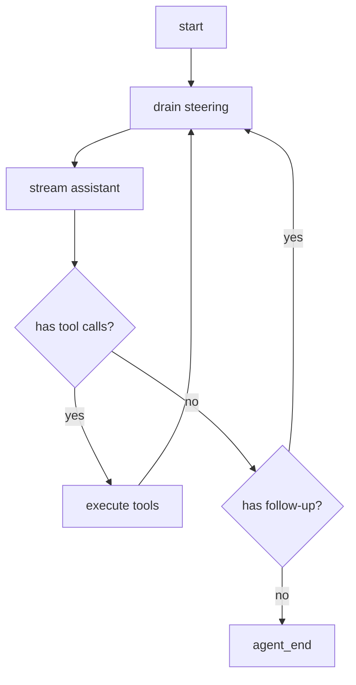

# Agent Loop 主循环

Pi 的 `runAgentLoop` 是整套系统最值得反复读的地方。它做的事情可以用一句话概括：

> 把用户消息加入上下文，请求模型；如果模型要求调用工具，就执行工具、追加工具结果，再继续请求模型；直到没有工具调用、被中止或被配置要求停止。

## 极简伪代码

真实实现有流式事件、队列、hook、并发工具、错误处理。先看压缩到最小的版本：

```ts
async function runAgentLoop(context, config) {
  while (true) {
    const assistant = await streamAssistantResponse(context, config);
    context.messages.push(assistant);

    const toolCalls = assistant.content.filter((block) => block.type === "toolCall");
    if (toolCalls.length === 0) {
      return;
    }

    for (const call of toolCalls) {
      const tool = context.tools.find((tool) => tool.name === call.name);
      const result = await tool.execute(call.arguments);
      context.messages.push(toToolResultMessage(call, result));
    }
  }
}
```

这是所有 Agent 框架都绕不开的骨架。

## Pi 多出来的工程细节

### 1. 外层循环处理 follow-up

Pi 区分两类排队消息：

| 队列 | 什么时候注入 | 用途 |
| --- | --- | --- |
| `steering` | 当前助手轮次和工具调用结束后，下一次模型请求前 | 用户想在 Agent 工作中途改变方向 |
| `followUp` | Agent 本来要停止时 | 用户想排一个“做完以后再做” |

这就是为什么源码里有内外两层循环：内层处理工具和 steering，外层在停止前再检查 follow-up。



### 2. 流式消息先占位再更新

模型流一开始时，Pi 会把 partial assistant message 放进上下文。后续每个 `text_delta`、`thinking_delta`、`toolcall_delta` 都替换这个 partial。

这样 UI 可以持续显示最新状态，而最终 `done` 时再把 partial 替换成 final message。

### 3. 工具调用执行前要 prepare

Pi 的 `prepareToolCall` 做了四件事：

1. 找工具。
2. 兼容性处理参数。
3. schema 校验参数。
4. 调用 `beforeToolCall` hook，看是否允许执行。

任何一步失败，都会生成错误 tool result，而不是让循环崩掉。

### 4. 工具执行后要 finalize

`afterToolCall` 可以改写工具结果，例如截断、脱敏、标记错误或请求提前停止。

Pi 有一个小但重要的规则：只有当当前批次每个工具结果都设置 `terminate: true` 时，才会提前停止工具循环。这样一个工具的“想停止”不会误杀其他并行工具的结果。

## 源码阅读路线

建议按这个顺序读 Pi 源码：

| 文件 | 看什么 |
| --- | --- |
| `packages/agent/src/types.ts` | `AgentMessage`、`AgentTool`、`AgentEvent`、`AgentLoopConfig` |
| `packages/agent/src/agent-loop.ts` | `runLoop`、`streamAssistantResponse`、`executeToolCalls` |
| `packages/agent/src/agent.ts` | `Agent` 如何包装 loop，维护状态和队列 |
| `packages/ai/src/types.ts` | 统一的消息和流式事件协议 |

## 对应 Demo

运行：

```bash
npm run demo:01
```

这个 Demo 删掉了工具和持久化，只保留“上下文 -> 模型 -> 事件 -> 最终消息”。读完这一节再看 Demo，会发现它就是 Pi Loop 的骨架缩影。
