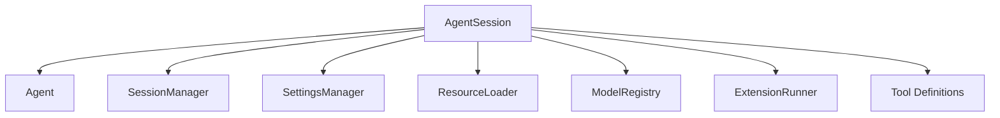
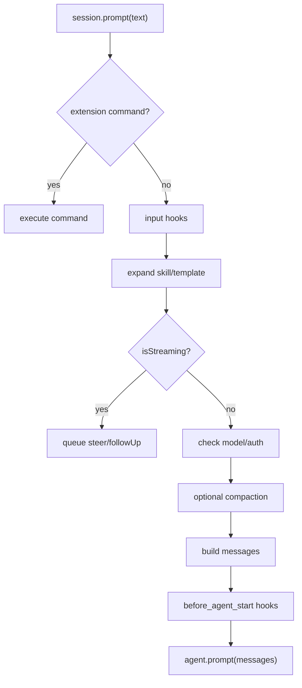

# AgentSession 运行层

如果 `Agent` 是发动机，`AgentSession` 就是把发动机装进车里的那层：它处理会话、资源、认证、扩展、压缩、内置工具和产品行为。

Pi 的 SDK 文档也把 `AgentSession` 定义为管理生命周期、消息历史、模型状态、压缩和事件流的核心对象。

## 它包住了什么

## prompt() 的前置工作

用户调用 `session.prompt(text)` 时，并不是直接交给模型。Pi 会先做一串 preflight：

1. 如果是扩展命令，例如 `/mycommand`，交给扩展执行。
2. 触发 input hook，允许扩展拦截或改写输入。
3. 展开技能命令和 prompt template。
4. 如果 Agent 正在运行，根据 `streamingBehavior` 放进 steering 或 follow-up 队列。
5. 检查模型是否存在、认证是否可用。
6. 必要时先触发压缩。
7. 构造用户消息和扩展注入的 custom message。
8. 触发 `before_agent_start`，允许扩展改系统提示词或注入消息。
9. 调用底层 `agent.prompt(messages)`。

## 会话持久化在哪里发生

底层 `Agent` 只维护内存状态。`AgentSession` 订阅 Agent 事件，在 `message_end` 时把消息 append 到 `SessionManager`。

这是一种很清晰的分层：

| 层 | 是否关心磁盘 |
| --- | --- |
| `Agent Loop` | 不关心 |
| `Agent` | 不关心，只管状态和事件 |
| `AgentSession` | 关心，把事件转成持久化 |
| `SessionManager` | 只关心 JSONL 和树结构 |

## Runtime 重建

为什么还需要 `AgentSessionRuntime`？

因为有些操作不是“在当前会话追加消息”，而是替换整个运行上下文：

| 操作 | 为什么要重建 |
| --- | --- |
| `/new` | 新 session file、新 leaf |
| `/resume` | 切到另一个 session file |
| `/fork` | 基于旧会话创建新文件 |
| 改 cwd | 资源加载、工具 cwd、项目设置都变了 |

这时只替换 `messages` 不够，工具、扩展、资源、设置都可能要按新 cwd 重新构造。

## 教学版怎么对应

我们的教学版不会完整实现 `AgentSessionRuntime`，但会保留这个分层思想：

| Pi | 教学版 |
| --- | --- |
| `Agent` | `runAgentLoop()` + 内存 context |
| `AgentSession` | `/api/prompt` 里的 orchestrator |
| `SessionManager` | `JsonlSessionStore` |
| `ResourceLoader` | 静态 system prompt + 工具注册表 |
| `ExtensionRunner` | 简化 hooks |

当你理解这个映射，就不会被 Pi 的真实代码量吓到。它本质上是在把同一条链路做得更完整、更可扩展。
