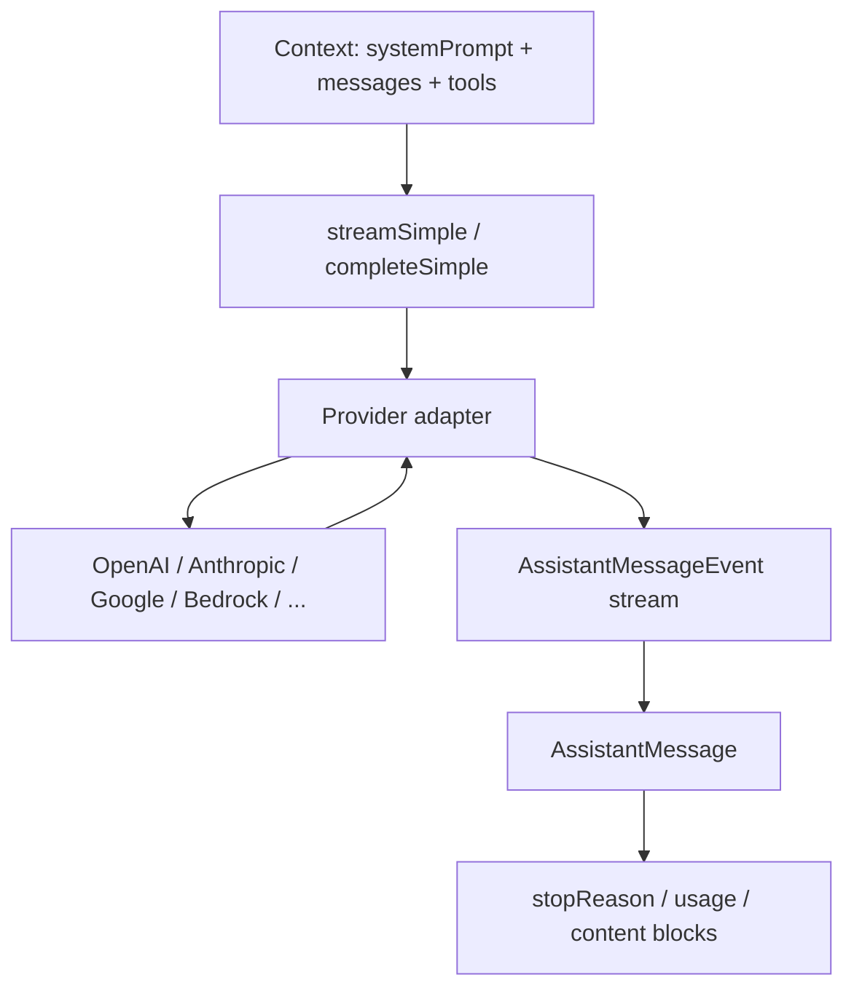
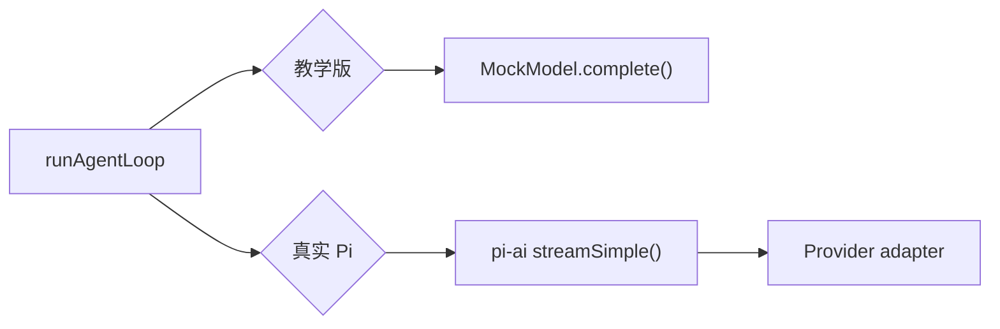

# pi-ai：模型协议层

`@earendil-works/pi-ai` 是 Pi 里最容易被低估的一层。它不负责“让 Agent 更聪明”，而是负责一件更底层的事：把不同模型供应商的输入、输出、流式事件和工具调用整理成同一种协议。

如果没有这一层，Agent Loop 里会到处出现这样的分支：

```ts
if (provider === "anthropic") {
  // 解析 tool_use
} else if (provider === "openai-responses") {
  // 解析 function_call
} else if (provider === "google") {
  // 解析另一套结构
}
```

这会让核心 loop 很快失控。Pi 的思路是：供应商差异在 `pi-ai` 里解决，`pi-agent-core` 只消费统一后的消息和事件。

## 这一层解决什么问题

| 问题 | 如果没有协议层 | Pi 的做法 |
| --- | --- | --- |
| 工具调用结构不同 | Agent Loop 要理解每家 API | 统一成 `ToolCall` content block |
| 流式输出格式不同 | UI 和 loop 被 provider 细节污染 | 统一成 `AssistantMessageEvent` |
| token 用量字段不同 | 压缩逻辑拿不到稳定 usage | 统一成 `Usage` |
| 错误和中止表达不同 | 运行时难以恢复 | 统一成 `stopReason` 和错误消息 |
| thinking / cache / 图片能力差异 | 上层到处写兼容代码 | 由 model/provider capability 描述 |

## 核心类型关系



可以把 `Context` 理解成模型请求的稳定输入：

```ts
type Context = {
  systemPrompt: string;
  messages: Message[];
  tools?: Tool[];
};
```

输出不是一个字符串，而是一条 `AssistantMessage`：

```ts
type AssistantMessage = {
  role: "assistant";
  content: Array<TextContent | ThinkingContent | ToolCall>;
  stopReason: "stop" | "length" | "toolUse" | "error" | "aborted";
  usage: Usage;
  timestamp: number;
};
```

这就是为什么本教程一直强调“消息不是字符串”。工具调用、thinking、错误、图片和 token 用量都需要结构化位置。

## 从 provider 到 Agent 的转换链路

```mermaid
sequenceDiagram
  participant Loop as Agent Loop
  participant AI as pi-ai
  participant Adapter as Provider Adapter
  participant API as Remote Model API

  Loop->>AI: streamSimple(context, options)
  AI->>Adapter: normalize context
  Adapter->>API: provider-specific request
  API-->>Adapter: provider-specific stream
  Adapter-->>AI: AssistantMessageEvent
  AI-->>Loop: text/tool/thinking/error events
  Loop->>Loop: assemble AssistantMessage
```

注意这个链路里有两个方向的转换：

| 方向 | 转换内容 |
| --- | --- |
| 出站 | Pi 的 `Message[]`、`Tool[]` 转成供应商请求体 |
| 入站 | 供应商事件转成 Pi 的 `AssistantMessageEvent` |

上层拿到的是统一事件，所以 `runAgentLoop` 不需要知道远端具体协议。

## 应该先读哪些源码

| 文件 | 阅读目标 |
| --- | --- |
| `packages/ai/src/types.ts` | `Message`、`Tool`、`Context`、`AssistantMessageEvent`、`Model` |
| `packages/ai/src/stream.ts` | `streamSimple()` 和 `completeSimple()` 如何驱动 provider |
| `packages/ai/src/providers/transform-messages.ts` | 消息如何转成供应商格式 |
| `packages/ai/src/providers/openai-responses.ts` | 一个真实 provider 适配器怎么处理工具和流式事件 |
| `packages/ai/src/providers/anthropic.ts` | 对比另一家 provider 的差异如何被抹平 |
| `packages/ai/src/api-registry.ts` | provider/api 如何注册和查找 |

第一次读时，不要陷进每家 API 的参数细节。先抓住三个不变量：

1. 上层只传 `Context`。
2. 下层只吐 `AssistantMessageEvent`。
3. 最终都能组装成 `AssistantMessage`。

## 和教学版 MockModel 的关系

教学版没有实现 `pi-ai`，而是用 `MockModel` 站在同一个位置上：



`MockModel` 的任务不是模拟某一家供应商，而是模拟协议层给 loop 的结果：

```ts
const assistant = await model.complete({
  systemPrompt,
  messages,
  tools
});
```

只要它返回的 `AssistantMessage` 结构不变，未来换成真实模型时，`runAgentLoop()` 就不需要重写。

## 常见误区

| 误区 | 为什么会出问题 |
| --- | --- |
| 直接让业务代码调用 OpenAI/Anthropic SDK | 后面每换一家模型都要改 Agent Loop |
| 把工具调用塞进文本里解析 | JSON 不稳定，模型输出稍微变形就炸 |
| 只保存最终文本，不保存 usage | 压缩和成本统计会失去依据 |
| 把 provider 错误直接 throw 到 UI | session、事件流和工具状态无法收尾 |

## 小练习

打开 `examples/teaching-agent/src/server/agent/mockModel.ts`，给 `complete()` 增加一个分支：当用户输入包含“写笔记”时返回 `write_note` 工具调用。你会发现只要返回结构符合 `AssistantMessage`，loop 不需要知道“模型为什么这么想”。

