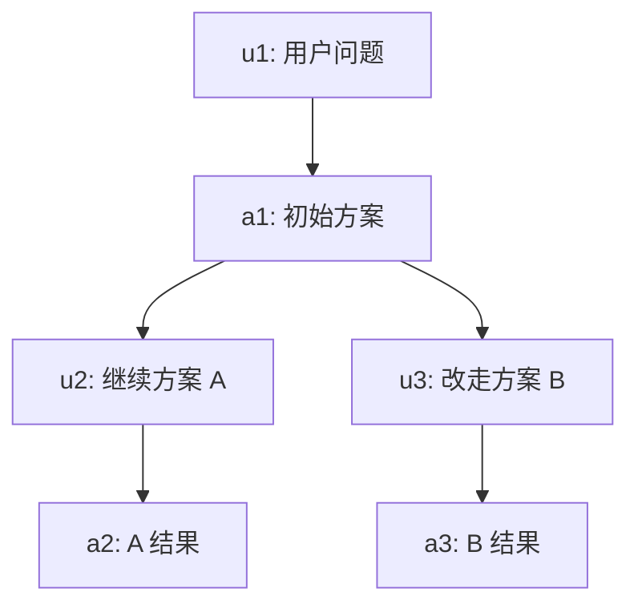
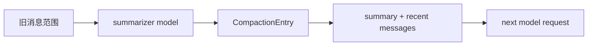
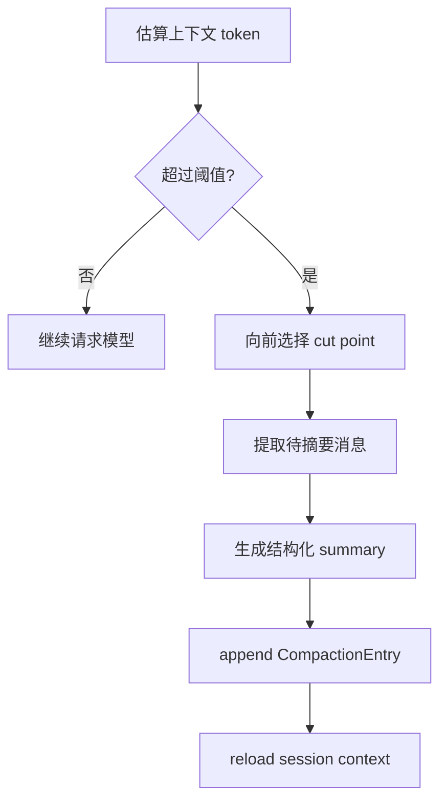

# 会话格式、分支与压缩链路

Pi 的会话系统看起来像“保存聊天记录”，实际承担的是 Agent 的长期记忆、树形探索、恢复、压缩和扩展持久化。

官方 Session Format 文档明确说明：session 是 JSONL，每一行有 `type` 字段，条目通过 `id` / `parentId` 形成树。这是 Pi 能在同一个文件里做原地分支的基础。

## JSONL 为什么适合 Agent

```text
{"type":"session","version":3,"id":"s1","cwd":"/repo"}
{"type":"message","id":"u1","parentId":null,"message":{"role":"user","content":"修复测试"}}
{"type":"message","id":"a1","parentId":"u1","message":{"role":"assistant","content":[]}}
{"type":"compaction","id":"c1","parentId":"a1","summary":"前面已经定位到...","firstKeptEntryId":"u8"}
```

JSONL 有几个工程上的好处：

| 好处 | 对 Agent 的意义 |
| --- | --- |
| append-only | 每条消息完成就能写入，崩溃损失小 |
| 每行独立 | 解析坏行、迁移版本、外部脚本处理都更简单 |
| 天然日志形态 | 适合记录 message、model_change、compaction、custom entry |
| 不强制线性 | 配合 `parentId` 可以表达树 |

## entry 类型不是装饰

Pi 的 session entry 不只包括消息。不同 entry 负责恢复不同维度的运行状态：

| entry | 解决的问题 |
| --- | --- |
| `message` | 构建后续 LLM 上下文 |
| `model_change` | 恢复当前模型选择 |
| `thinking_level_change` | 恢复 reasoning 设置 |
| `compaction` | 用摘要替代旧上下文 |
| `branch_summary` | 切换分支时携带离开分支的发现 |
| `custom` | 扩展保存自己的状态 |
| `custom_message` | 扩展注入可进入上下文的消息 |
| `label` / `session_info` | UI 和会话管理信息 |

很多教学项目只保存 `role/content`，这对玩具聊天没问题，但一旦要恢复真实 Agent 行为，就会不够。

## 从 leaf 构建上下文

构建上下文时，Pi 不是读取文件里的所有 message，而是从当前 `leafId` 沿 `parentId` 回到根，再反转。



如果当前 leaf 是 `a3`，上下文路径是 `u1 -> a1 -> u3 -> a3`。`u2 -> a2` 仍在文件里，但不属于当前分支。

伪代码如下：

```ts
function buildPath(leafId: string, entries: Map<string, Entry>) {
  const path: Entry[] = [];
  let current = entries.get(leafId);

  while (current) {
    path.unshift(current);
    current = current.parentId ? entries.get(current.parentId) : undefined;
  }

  return path;
}
```

## 压缩不是删除历史

上下文压缩经常被误解成“删掉旧消息”。Pi 的设计更像追加一条新的摘要 entry：



关键点有三个：

1. 原始历史仍在 JSONL 文件中。
2. 后续上下文使用摘要和最近消息。
3. 摘要 entry 记录 `firstKeptEntryId`，说明从哪里开始保留原文。

这让系统同时拥有“短上下文可继续工作”和“完整历史可审计/重建”两个能力。

## 什么时候压缩

Pi 的 compaction 逻辑会根据上下文 token 和模型窗口判断。核心条件可以简化成：

```ts
contextTokens > contextWindow - reserveTokens
```

默认策略会预留一段响应空间，再向前选择 cut point，并保留最近一段消息。保留最近消息非常重要，因为最新工具输出、错误日志和用户约束通常不能只靠摘要。



## branch summary 和 compaction 的区别

| 机制 | 触发 | 目的 |
| --- | --- | --- |
| Compaction | 上下文过长或用户 `/compact` | 减少当前分支的 token 占用 |
| Branch Summary | `/tree` 导航或切换分支 | 把离开分支的重要发现带到新分支 |

它们都用摘要，但解决的问题不同。压缩是在同一条路上“减重”，branch summary 是换路时“带经验”。

## 源码阅读路线

| 文件 | 看什么 |
| --- | --- |
| `packages/coding-agent/src/core/session-manager.ts` | entry 类型、JSONL 读写、leaf、树导航、context 构建 |
| `packages/coding-agent/src/core/compaction/compaction.ts` | 触发条件、token 估算、cut point、CompactionEntry |
| `packages/coding-agent/src/core/compaction/branch-summarization.ts` | 分支切换时如何生成 summary |
| `packages/coding-agent/src/core/compaction/utils.ts` | 消息序列化、文件操作追踪、summary prompt |
| `packages/coding-agent/src/core/messages.ts` | compaction/custom/branch summary 如何变成 AgentMessage |

读源码时，重点看两个转换：

1. `SessionEntry[]` 如何变成 `AgentMessage[]`。
2. 老消息如何变成 `CompactionEntry` 再重新进入上下文。

## 教学版保留了什么

| Pi | 教学版 |
| --- | --- |
| JSONL session file | `.teaching-agent/session.jsonl` |
| `id` / `parentId` / `leafId` | 保留 |
| 多种 entry 类型 | 只实现 `message` 和简化 `compaction` |
| LLM summary | 用确定性 summarizer 模拟 |
| branch summary | 作为扩展方向 |

教学版的目标是让读者先掌握结构，不让真实压缩 prompt、token 估算和分支 UI 把主线冲散。

如果你已经理解这条主线，下一页 [进阶：真实 Pi 为什么压缩更复杂](/source/advanced-compaction) 会继续拆 `reserveTokens`、`keepRecentTokens`、turn boundary、split turn、重复压缩和文件操作追踪这些真实边界。

## 小练习

在 `examples/teaching-agent/src/server/agent/sessionStore.ts` 里给 compaction entry 加一个 `tokensBefore` 字段，并在前端时间线里展示它。这个练习能把“压缩是运行时事件”这件事变得很直观。
