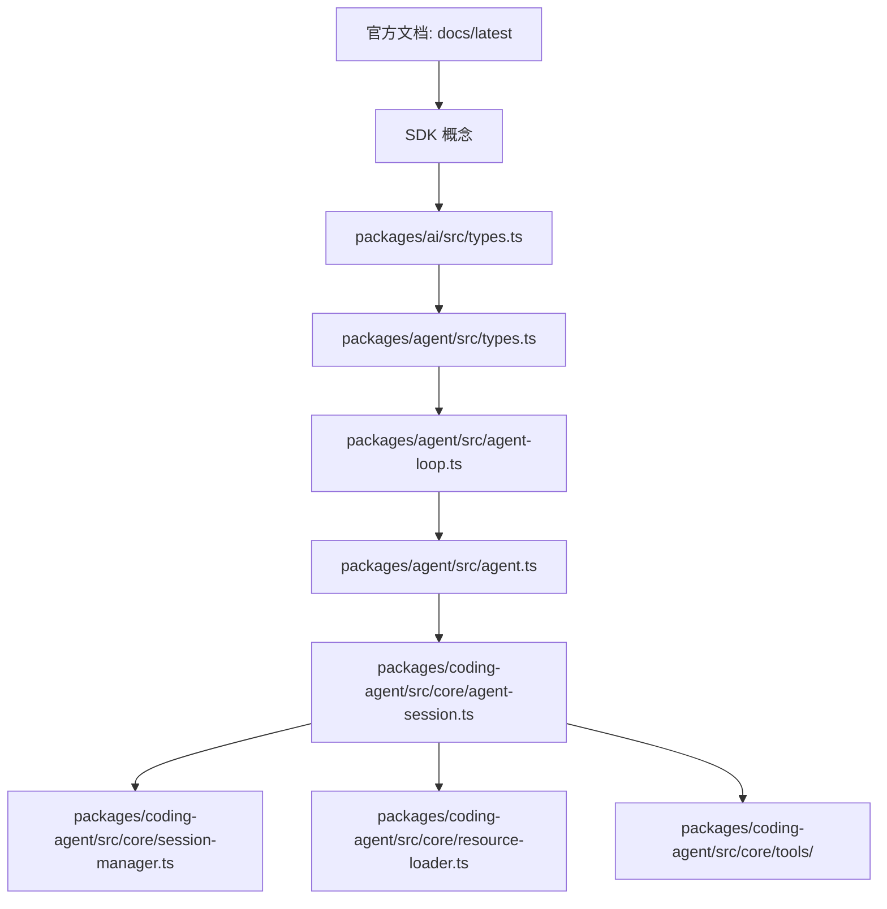
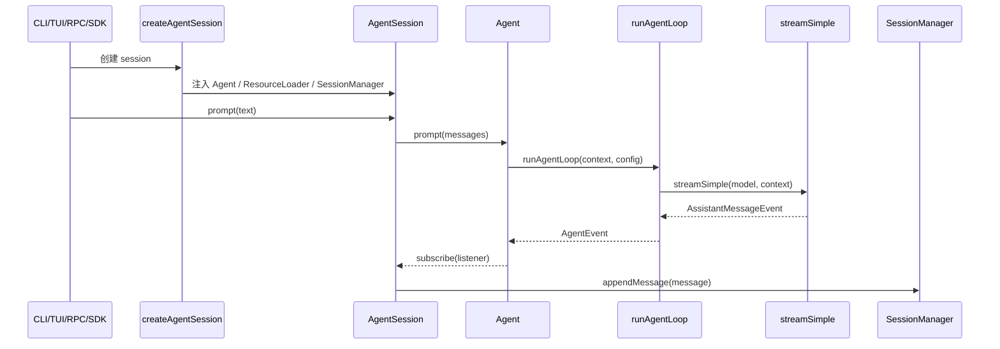

# 源码阅读地图

读 Pi 源码最容易卡住的地方，不是某个函数太难，而是入口太多：CLI、TUI、SDK、RPC、扩展、工具、模型供应商都在同一个 monorepo 里。正确读法是先找“稳定骨架”，再看产品层怎么把骨架包装成可用工具。

## 先看哪一层

这个顺序的好处是，你先理解“消息和事件长什么样”，再看 loop 怎么消费它们，最后才进入会话、扩展、TUI 这些产品复杂度。

本教程把这条路线拆成五个源码页：

| 顺序 | 页面 | 读完应该得到什么 |
| --- | --- | --- |
| 1 | [pi-ai 模型协议层](/source/model-protocol) | 为什么 provider 差异不能泄漏到 Agent Loop |
| 2 | [Agent Loop 主循环](/source/agent-loop) | 模型请求、工具执行、工具结果回写的最小闭环 |
| 3 | [工具、扩展与资源加载](/source/tools-extensions) | 工具能力、扩展插槽和启动资源如何装配 |
| 4 | [AgentSession 运行层](/source/agent-session) | `prompt()` preflight、持久化、runtime 重建 |
| 5 | [会话格式与压缩链路](/source/session-compaction) | JSONL 树、compaction、branch summary 如何工作 |

## 三个包的边界

| 包 | 先读文件 | 读懂后你应该能回答 |
| --- | --- | --- |
| `pi-ai` | `src/types.ts`、`src/stream.ts` | 模型调用统一成了哪些消息、事件、工具协议？ |
| `pi-agent-core` | `src/types.ts`、`src/agent-loop.ts`、`src/agent.ts` | Agent 如何一轮轮请求模型、执行工具、维护状态？ |
| `pi-coding-agent` | `src/core/sdk.ts`、`src/core/agent-session.ts`、`src/core/session-manager.ts` | 一个纯 loop 如何变成有会话、扩展、压缩和工具的产品？ |

Pi 官方文档也按相近维度组织：总览强调 Pi 是一个小核心、靠扩展和技能成长的 terminal coding harness；SDK 文档把 `createAgentSession()`、`AgentSession`、事件、工具、ResourceLoader 列为编程入口；Session Format 文档解释 JSONL 会话和树结构。

## 一条主线读到底

建议第一次阅读只追一条路径：用户输入一句话，到磁盘里出现一条 session message。

先不要追所有扩展 hook。等这条主线通了，再回头看每个 hook 插在哪里。

## 第二遍再读扩展点

扩展系统很强，但它不是 Agent 的第一性原理。第二遍可以按“扩展能拦在哪里”来读：

| 扩展点 | 所在阶段 | 作用 |
| --- | --- | --- |
| `input` | `AgentSession.prompt()` 前 | 改写或接管用户输入 |
| `before_agent_start` | 构造消息后、调用 Agent 前 | 注入 custom message 或修改 system prompt |
| `before_provider_request` | 请求模型前 | 修改 provider payload |
| `tool_call` | 工具执行前 | 审批、拦截、改参数 |
| `tool_result` | 工具执行后 | 脱敏、截断、改结果 |
| `session_before_compact` | 压缩前 | 自定义压缩策略 |

这些扩展点解释了为什么 Pi 的核心 loop 不需要知道所有产品需求：产品需求被挂在运行层和 hook 上。

## 常见读源码误区

| 误区 | 会卡在哪里 | 建议 |
| --- | --- | --- |
| 从 TUI 组件开始读 | UI 状态很多，看不见 Agent 主线 | 先读 `packages/agent` |
| 从模型 provider 开始读 | 各家 API 差异太多 | 先读 `pi-ai/src/types.ts` 的统一协议 |
| 只看 `AgentSession` | 会觉得它什么都做 | 先把 Agent/SessionManager/ResourceLoader 分开 |
| 忽略测试 | 看不到边界条件 | 对照 `packages/agent/test` 里的 loop 行为 |

## 和本教程的对应关系

| 本教程章节 | 对应源码 |
| --- | --- |
| Agent 到底是什么 | `packages/agent/src/agent-loop.ts` 的最小循环 |
| 消息、流式事件与状态 | `packages/ai/src/types.ts`、`packages/agent/src/types.ts` |
| 工具调用机制 | `executeToolCalls`、`prepareToolCall`、`finalizeExecutedToolCall` |
| 会话、树与分支 | `packages/coding-agent/src/core/session-manager.ts` |
| 上下文、技能与压缩 | `resource-loader.ts`、`system-prompt.ts`、`compaction/` |
| 教学版目标项目 | `examples/teaching-agent/src/server/agent/*` |

## 源码里的五个不变量

源码读到后面，文件会很多。你可以反复用这五个不变量校准自己有没有跑偏：

| 不变量 | 你应该在哪里看到 |
| --- | --- |
| 模型输入输出被统一成结构化消息和事件 | `pi-ai` |
| Agent Loop 不直接做产品 I/O | `pi-agent-core` |
| 工具副作用必须经过 schema、hook 和 tool result | `agent-loop.ts` 与 `tools/` |
| 会话不是数组，而是 JSONL entry tree | `session-manager.ts` |
| 长上下文用摘要 entry 承接，而不是删除历史 | `compaction/` |

读源码时只要发现某段代码在保护这些不变量，就先理解它“为什么存在”，再看它“具体怎么写”。
