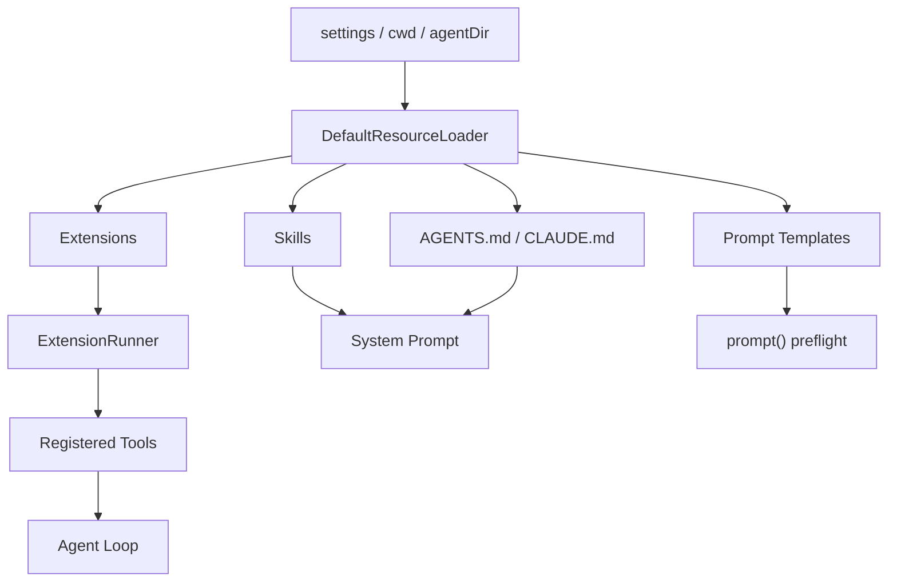
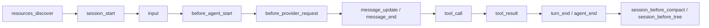
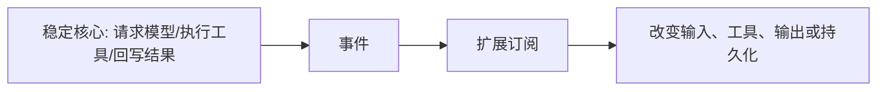

# 工具、扩展与资源加载

工具让 Agent 能做事，扩展让用户能改变 Agent 的行为，资源加载则决定启动时有哪些工具、技能、提示模板和上下文文件进入运行时。

这三者放在一起理解，会比逐个看文件更清楚：工具是能力，扩展是插槽，ResourceLoader 是装配线。

## 三者的边界

| 机制 | 核心职责 | 什么时候运行 |
| --- | --- | --- |
| Tool | 被模型调用，执行本地副作用或查询 | Agent Loop 发现 `toolCall` 后 |
| Extension | 监听事件、注册工具/命令、拦截输入和工具 | 会话生命周期、模型请求、工具执行、UI 交互中 |
| ResourceLoader | 发现扩展、技能、prompt templates、context files | 创建 session 或 reload 时 |



## 工具从哪里来

Pi 的工具大致有两类：

| 来源 | 例子 | 特点 |
| --- | --- | --- |
| 内置工具 | `read`、`bash`、`edit`、`write`、`grep`、`find`、`ls` | coding agent 的基础能力 |
| 扩展工具 | 用户通过 `pi.registerTool()` 注册 | 可以接外部服务、公司内部系统或自定义工作流 |

工具定义不仅是给模型看的“说明”，也是运行时的安全边界：

```ts
type ToolDefinition = {
  name: string;
  description: string;
  parameters: unknown;
  execute(input: unknown): Promise<unknown>;
};
```

真正执行前，Pi 会找工具、处理参数兼容、校验 schema，并触发工具事件。任何一步失败，都应该变成 tool result，而不是让进程直接崩溃。

## 扩展事件像一排检查点

官方扩展文档把扩展定义为 TypeScript 模块，可以订阅生命周期事件、注册工具、增加命令、自定义 UI 和持久化状态。理解它时，可以把事件看成一排检查点：



不同扩展只需要挂在自己关心的位置：

| 需求 | 更适合的扩展点 |
| --- | --- |
| 禁止写 `.env` | `tool_call` |
| 给每次运行自动加上下文 | `before_agent_start` |
| 改写 provider 请求 | `before_provider_request` |
| 自定义压缩摘要格式 | `session_before_compact` |
| 加一个 `/deploy` 命令 | `registerCommand()` |
| 保存扩展自己的状态 | `appendEntry()` |

## 为什么扩展不应该塞进 Agent Loop

一个常见冲动是把所有产品需求都写进 loop：权限审批、Git 快照、远程执行、公司内部工具、UI 渲染。这样短期快，长期会让 loop 无法测试。

Pi 把这些需求放到扩展系统里，核心 loop 只保留最稳定的控制流：



这和浏览器事件、Express 中间件、数据库 hook 的思路类似：核心做少一点，插槽设计清楚一点。

## Skills 和 Prompt Templates 不是扩展的替代品

| 机制 | 本质 | 典型用途 | 是否执行代码 |
| --- | --- | --- | --- |
| Extension | TypeScript 运行时代码 | 工具、命令、事件拦截、UI | 是 |
| Skill | 按需加载的说明书和资产 | 可复用工作流、操作步骤、脚本说明 | 可包含脚本，但由 Agent 决定调用 |
| Prompt Template | 可复用用户提示 | 常用任务模板 | 否 |
| Context File | 项目长期规则 | 编码规范、运行命令、仓库约定 | 否 |

初学者最容易混用这几个东西。判断方法很简单：

1. 需要改变运行时行为，用 Extension。
2. 需要教 Agent 做一类任务，用 Skill。
3. 需要复用一段用户输入，用 Prompt Template。
4. 需要长期告诉 Agent 项目规则，用 Context File。

## 源码阅读路线

| 文件 | 看什么 |
| --- | --- |
| `packages/coding-agent/src/core/resource-loader.ts` | 资源如何从 cwd、agentDir、settings 进入运行时 |
| `packages/coding-agent/src/core/extensions/types.ts` | 扩展 API、事件、工具定义和上下文类型 |
| `packages/coding-agent/src/core/extensions/runner.ts` | 扩展事件如何分发和收集结果 |
| `packages/coding-agent/src/core/tools/index.ts` | 内置工具如何组装 |
| `packages/coding-agent/src/core/tools/tool-definition-wrapper.ts` | 工具定义如何适配 Agent 内核 |
| `packages/coding-agent/src/core/skills.ts` | Skills 如何发现和描述 |
| `packages/coding-agent/src/core/prompt-templates.ts` | Prompt template 如何展开 |

读这部分时，建议先看“注册”和“触发”两条线：

| 线索 | 你要找的问题 |
| --- | --- |
| 注册线 | 工具、命令、事件 handler 是什么时候加入 runtime 的？ |
| 触发线 | 用户输入、模型请求、工具执行、压缩时分别触发哪些事件？ |

## 教学版保留了什么

教学版没有实现完整扩展系统，但保留了三个关键思想：

| Pi | 教学版 |
| --- | --- |
| `registerTool()` | `ToolRegistry.register()` |
| `tool_call` / `tool_result` 事件 | `tool_start` / `tool_end` 事件时间线 |
| ResourceLoader 动态发现 | 静态注册 `list_files`、`read_file`、`write_note` |

这已经足够让读者理解：模型不能直接做副作用，所有能力都要通过受控工具暴露。

## 小练习

在教学版里加一个非常小的 hook：执行 `write_note` 前，如果文件名不是 `.md` 结尾，就返回错误 tool result。这个练习能帮你体会为什么生产级 Agent 需要 `tool_call` 拦截点。

